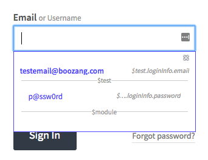

# Boozang


[Live Example](https://moqmar.github.io/shell-setup/)


## Why use Boozang?
### At the core

Boozang is a code-less front end testing tool built for the modern web using only Javascript. It allows developers and Quality Assurance engineers to develop front-end tests quickly without the need for programming. 

Boozang is not based on Selenium, and does not have the limitations of Selenium and Selenium web driver. Boozang uses it´s own selection language based on natural-language, allowing for native support of TTD / BDD (test/behavior driven developement) and allows for tests to be automatically generated from models. 

### About the Technology

The Boozang test technology is divided into two parts. The propreietary part of the tool which allows you to author tests record fast and the Open Source test runner which is built on Google Puppeteer, which allows you to run tests rom command-line and integrate Boozang into your CI flow or otther tools. 

* **Boozang tool**: Sign up at https://boozang.com for free and paid license offerings.

* **Boozang test-runner:** For the Boozang Puppeteer open source test runner see https://github.com/ljunggren/bz-puppeteer and the Docker container https://github.com/degardinn/docker-boozang

### Features

**Stable to code changes**

Boozang is fundamentally different from other test tools. Boozang uses natural language to identify browser elements, instead of the DOM elements, making tests incredibly stable to changes of the underlying implementation. Actually, it´s possible to completely change the underlying technology without affecting the tests. You can go from a Java legacy application to Angular and the tests remain the same, as long as the business requirements do. 

**Automated documentation**

As Boozang is completely based on natural language, all recorded tests are also a user manual. When a label changes, such as "Create Project" being changed to "Add Project", the test will need to be updated accordingly. This means all test documentation is always up-to-date.

**AI test repair**

As your code changes, Boozang tests remain stable. If you do change any labels or item identifier, Boozang will automatically suggest how to repair your tests, or if no suggestion is available, allow you to reselect the element on the page. This reduces test maintenance immensely and allows you to repair broken tests on the fly. 

**BDD / TDD**

Boozang is built for Test-driven and Behavior-driven development minus the programming effort. Start writing tests directly from requirements. The Boozang AI engine will automatically build tests from your documented test steps. No need to spend the time to maintain a test middleware layer.

**Linkability**

Boozang is completely built in Javascript and being CLoud-based there is no need for any client-side installation. Simply add an HTML-fragment to your site to activate it for testing.

**Cross-browser support**

As Boozang doesn't rely on browser extensions or client-side install, it natively runs in any web browser (Chrome, Firefox, Safari, Opera). 

**Web components / Shadow DOM support and socket-based testing**

Supports Web Components / Shadow DOM testing and socket-based testing. 

### When to use Boozang

**Good fit vs bad fit**

Boozang is great when testing anything that runs in the web browser. This includes any modern SaaS application, no matter how complex. It´s great when you need to test automate testing for deterministic usage flows, basically conditions that can be determined by a machine. 

A rule of thumb is that the more you feel the need to run regression testing, the more value you will find in a Boozang implementation. This means, if you release business critical software often, you will find great value in Boozang. If you release rarely and bugs doen´t have a significant impact, maybe not so much. 

A less than ideal fit is also SaaS applications that do a lot of very graphical stuff that needs a human to make a judgement call. Thiese flows can never be fully automated and the value of automation can be limited. 

**A note on supported technology**

Boozang supports any application that runs in the web browser. Boozang also supports hybrid approaches, such as Cordova, Ionic and Xamarin.

Since March 2019, Boozang also fully supports Shadow DOM / Web Components. 

Boozang does not support any testing of native IOS and Android application, or any desktop-based applications. 

## Getting started

### Signing  up / Logging in

You can sign-up for Boozang from the Boozang homepage at Https://boozang.com. The sign-up link will take you to https://ai.boozang.com. This is the Boozang application server and this is responsible for communicating with the any instances of the Boozang tool, wbich is actually running locally on the client side. 

This is also where an administrator can maintain different teams and different projects, without having to launch anything client-side. 

### Creating and launching a project

As soon as you have signed up you can go ahead and create your first project in the Cloud dashboard, by clicking the button "Create Project". There are a lot of options available here, but the only thing required is the project name. 


### Installation Options
Boozang is completely hosted in the Cloud and supports running from client-side without a client-side installation Simply create a project and download the bz.html snippet and put it into your web application root. For users who do not have access to the application root we also provide a Chrome browser extension. 

**Installing the Chrome extension** 

For users without access to the application web root, or for users who want to do cross-domain testing, we also provide a Chrome extension. The Chrome extension can be downloaded from the Chrome web store here: https://chrome.google.com/webstore/detail/boozang/feijjbehfljebjillfefcehfmlolcomf. To launch the Boozang tool using the Chrome extension, simply click "Launch" in the Cloud manegement interface, and you will be promted to install the Chrome extension. 

**Installing the bz fragment**

The HTML snippet technology is completely secure as it´s reliant on the built-in security of the HTTP protocol. Simply create a project at http://ai.boozang.com and download the HTML snippet. The snippet is copied to the web root (where your index.html or similar would be located). In order to launch the Boozang tool, simply access the snippet in any browser, such as http://myapplication.com/bz.html or http://localhost:8080/bz.html. 

**Setting the environment**

Boozang supports many appliaction interfaces (mgmt, traffic, store) across many different environments (test, qa, staging, production). The purpose of this is to be able to allow a single test to be re-used across different environments without any risk of having to edit the test. If tests are duplicated and individually customized to run on an environment, over time maintaining these tests gets very expensive, so it´s better to set this up properly from the get-go. 

### Modules and Tests

**Object-Oriented testing**

Boozang takes an object-oriented approach to testing. Just like your application can be divided into modules and sub-modules, so can your tests. It takes some experience to make the perfect test break-down, and it´s different from application to application. Usually, it´s best to try and mirror the components, or modules, of the application in the Boozang tool. The below image gives an example of this


**Modules**


The modules are used to divide your tests into functional areas of your application. Where other tools usually have tests and test suites, or test suites are just another test in Boozang (using Plug test-case). Modules are used to organize tests to match the functional modules of the application. They work as folders to organize your tests, but also to allow data to be added on the module level. For instance, in the Inventory module in the example, the Test data for inventory should typically be saved as Module data. 

**Sub-modules**

For very complex application it can sometimes be useful to introduce sub-modules. This is particularly useful when you clearly have sub-modules on the application side. For most SaaS applications, such as CMS (content-management system) or ERP (Enterprise resource planning), the application is organized in two levels, making the project-module-test hierarchy sufficient. 

### Recording your first test

Boozang works within the browser which allows for a very stable recording function. Simply click on the record button in the tool. As you perfrom actions on your web page actions will be recorded. To remove an un-wanted action that was recorded simply press the trashbin next to the action in the main tool view. 

As soon as a test has been created you can use the playback button to replay the test steps. Boozang supports 3 different playback modes: Normal, demo and debug mode. Demo mode slows down the playback speed and annotates every test step. This is good for demos and when trying to understand a test that someone else has authored. Debug mode is a very powerful functionality that plays the test, but when encountering an error it highlight the error and allows you to correct it on the fly. When you have corrected the error simple press the play button again and the test will continue it´s execution. This is very useful when updating a test after a big code change. 

A test is automatically saved in the local storage of the browser. As soon as you update a test, the test will be checked out by you, and it will appear as locked for your team-mates, which prevents them from making changes. As soon as you click save the test will be saved on the Boozang server, and the lock will be automatically removed, allowing other team-members to make changes. 

**A note on Window aligment**

In order to use Boozang well, we recommend aligning the Boozang tool and your application next to each other side by side in the following way


This allows you to get a good overview of the recorded actions, and an easy way to modify or delete recorded actions.

### In-tool help

As Boozang is completely hosted in the Cloud it´s easy to do changes and add useful features quickly. This has a huge upside as we are able to deploy features that customer asks for to all our customers at the same time, to the benefit of all. This also means that new things can appear in the user interface without warning, and in some cases, that the documentation might not be up-to-date all the time. 

For this reason, to be able to deliver new features fast without forcing the end user to re-learn, we added an online help function inside the tool. Simply click the question mark in the user interface, and click the functionality and an explanation will appear. 


In the help text, you will find an explanation of the function you selected. You will also find any related videos to that function, if available. When clicking a video link, a separate video window will appear and you will be able to follow along with the tool if needed. 

## The tool
### The top bar


**Project Name**

The first entry in the top bar will be the project name. Clicking on the project name will take you to the root of the project tree. 

**Module name / View name**

Clicking on the module name in test authoring view will take you to the module level of the tree. When being in a different view than test authoring view, this can be displaying the View name, such as Settings or Report.

**Test Name**

Only displayed in Test Authoring view, and displays the selected test. 

**Quick Navigation**

Use the Caret down icon to qucikly switch between modules and tests. You can also create new mdoules, new test suites and new tests from here. 

**Search**

To do free text search on any module or test simply hit the Search icon. As you type the search results will display. 

**Hamburger**

Click the hamburger icon to open the hamburger menu. 

### The sidebar


**Boozang icon**

Boozang icon is a shortcut to bring back the user to the project root. 

**Test Authoring View**

Test authoring view. This is the main view to create test cases and organize them in the project tree. The test cases you create is organized into modules, to ensure maximum reusability. 

You can record test cases or manually write tests directly. You can also add data on any level in the project tree.

**Bugs**

Bug authoring view. Use this section to record bugs, which are most often visual discrepancies of your application highlighted by the comment function.

In this view you have access to all authoring tools, with the difference that bugs can be assigned to other members in your team.

**Settings**

The project settings allows the user to set: Environment, Content Policy, Notifications, and Preferences.

**Reports**

The report view contains the report of the latest test run. When running a test, the user can also swith to the report view to see the report being written as the test runs. 

**Tools**

In tools you will find import and export tools for the project. This allows an admin user to backup proejcts and also to import projects from other users. There is also a powerful free text search that can search both modules and test and data, and perform replacement as well. 

### The hamburger menu


**Management**

Takes the user to the Boozang Cloud Management interface. This allows the user to switch projects. 

**Account**

Access the account page. Here you can see current service usage and your current license tier. 

**Console**

Opens the Boozang console. Allows the user to inspect data and trouble-shoot tests. 

**Chat & Message**

Opens a popup chat with the team. Here you can monitor project activity and chat with other project members. 

**Dock mode**

The dock mdoe allows the user to switch between undocked (two separate application windows), dock to left (Boozang IDE is to the left) and dock to right (Boozang is on the right). In some cases the applications under test doesn´t support docked mode, so use this option to Undock. 

**Video Tutorials**

This links to the Video tutorials on the homepage. 

**Functional Overview**

THis is a link to the latest version of this document. 

**Video Helper**

This opens a small helper that gives you topic based video help based on certain topics. 

Note: This video material can have been recorded on top of previous versions of Boozang. 

**Sign Out**

Logs out the user. 

### The action list


**Reload URL**

Reloads the test url in the application browser window. USe this before playing the test or when starting recording a new test, to make sure the correct URL is loaded in the application window. 

*Tip: Double-clicking the test row also runs action.* 

**Action icon**

An icon that indicates the action type. The different action types are **Validate Result**, **Mouse Event**, **Keyboard Event**, **Extract data**, **Javascript**, **Comment**, **Refresh Window**, **Plug Test**, and **Visit Links**.  

Tip: Clicking the action icon toggles breakpoints, which is a convenient way to troubelshoot tests. 

**Action description**

This is the human-readable description of the action, and defaults to the actual action code. This can be changed in the action details page.

**Data Indicator**

Orange indicates that dynamic data is used. The following data stops are available: $parameter, $test, $module, $project, $loop

**Add action in list**

Inserts an action in the action list. It´s also possible to initiate a recording that inserts actions anywhere in the list. 

**Run action**

Executes a single action. 

*Tip: Double-clicking the action row also runs action.* 

**Custom timeouts**

Indicates that the timeouts for that particular action has been customized. This can be done by editing timeouts in action details or can be automatically added by the recorder. 

**Custom exit conditions**

Indicates that exit conditions for the action has been customized. This can be set in action details in the kebab icon. 

**Action details**

Opens the action details panel. The action details can be pinned to stay open, or always be seen at the top or base of the action list. When pinned, action details simply shows the main controls. 

### Record / Play

### The toolbar


**Switch view: List / GUI**

The switch view button toggles between table and diagram view.

The views are equivalent in functionality, but the diagram view better illustrate the flow between tests, while the table view displays the actions in a more linear fashion.

**Parameter**

Use this to set dynamic data used by the test, to improve test re-usability. You can set this data when running the test, or pass it as a parameter from upstream test cases. When doing form fills, you can also bind the form data directly into the parameter.

Group

The group function groups actions together. This allows you do keep your test in order, and to skip a set of actions using the exit condition Exit Group.

Use Ctrl/CMD functions to multi-select.

**Make test case**

Breaks up a group of actions into a separate tests and replaces the group with a reference to that test (Plug-test case). A quick way to break up a recorded action sequence into re-usable test units.

**Cut / Copy /Paste**

Standard Cut functionality. Use Cut and Paste to move actions between tests, tests between modules, or data between tests and modules.

Use Ctrl/CMD functions to multi-select.

**Undo / Redo**

Undo /Redo last un-saved action. In Boozang, you cannot undo saved changes as they have been committed to the Cloud.

**Delete**

Deletes one or several actions. Use Ctrl/CMD functions to multi-select.

**Disable**

Disables action so it´s skipped when test is run. Useful to debug tests. 

### Action details
## Element selection
### The Boozang selector language

### The element bar
### Re-pickking an element
### Edit element with DOM picker
### Deep-dive of DOM picker
#### The Boozang elment path
Boozang uses 

#### The DOM picker window
For this reason, to be able to deliver new features fast without forcing the end user to re-learn, we added an online help function inside the tool. Simply click the question mark in the user interface, and click the functionality and an explanation will appear. 


#### Element path operation
The element path has the following operations. We've expanded the jQuery selction standard to create a more human-readable code to identify elements. The basic pattern is that the lowercase jQuery standard operations, while uppercase operations are case-insensitive. All recorded will generate Uppercase operations. The operations that will be recorded for a test-case is marked by an asterix (*) 

* nodeContains (*):  Is true if the selected element (case-insensitive) have the exact string alongside other strings
  ```
  Ex:div:match(lws)
  Yes:<div>lws ok</div>
  No:<div>lwsok</div>
  Yes:<div>lws <span>ok</span></div>
  No: <div><span>lws</span></div>
  ```

* nodeEquals (*): Is true if the selected element (case-insensitive) have the exact string
  
  ```
  Ex:div:equals(lws)
  Yes:<div>lws</div>
  No: <div>lws ok</div>
  No: <div>lwsok</div>
  No: <div><span>lws</span></div>
  ```
* nodeOrChildrenEquals: Is true if the selected element or any of it's children (case-sensitive) have the exact string alongside other strings
  ```
  Ex:div:equal(lws)
  Yes:<div><span>lws</span></div>
  No: <div>lws ok</div>
  ```
* nodeOrChildrenEquals (*): Is true if the selected element or any it's children (case-insensitive) matches
  
  ```
  Ex: div:Contains(lws)
  Yes:<div><span>LWs ok</span></div>
  No: <div>lwsok</div>
  ```

* nodeOrChildrenContainsWord: Is true if the selected element and all it's children (case-insensitive) matches
  ```
  Ex: div:Contains(lws)
  Yes:<div><span>lws ok</span></div>
  Yes:<div>lwsok</div>
  No: <div>lwok</div>
  ```

* RowCol (*):
  ```
  Ex: TD:RowCol([value|name])
  Yes:<tr><td></td><td>name</td></tr>
      <tr><td>value</td><td>1234</td></tr>
      
  No: <tr><td></td><td>name</td></tr>
      <tr><td>VALUE</td><td>1234</td></tr>
  ```
* rowcol:
  ```
  Ex: TD:rowcol([value|name])
  Yes:<tr><td></td><td>NAME</td></tr>
      <tr><td>VALUE</td><td>1234</td></tr>
      
  No: <tr><td></td><td>name</td></tr>
      <tr><td>value1</td><td>1234</td></tr>
  ```
* near (*):
  ```
  Ex: input:near(name)
  Yes:<div><label>name: <input/></label></div>
  Yes:<div><label>name: </label><input/></div>
  Yes:<tr><td>Name</td><td><input/></td></tr>
  No: <div>name</div><div><label>value</label><input/></div>
  ```
### Element policy
### AI test repair when element not found
## Recording and playback modes
### Recording a test
### Data bind



### Play modes


## Action types
### Mouse event

### Keyboard event
### Validation

**Creating a simple validation**

In a test, it´s common to make sure that a certain outcome is achieved. In Boozang we do this using validation, also known as assertions. To create a validation, simply click on the validation icon and select the element to validate in the application window. The default validation content format: "validate exists" will be created. If you want to change the validation content format to "innerText", "data", or "screenshot" you can do this in the tool window. 

**Validate Exists**

The default validation is "Validate Exists", that will simply verify that the element exists. To edit the validation content format simply change it from the action detail page. The expectation value will be automatically updated. 

**Inner Text**

If you want to validate the content of an element, change the Content format dropdown to innerText. This way the text content of an element is compared. When changing this, the result box will be populated with the content from your application but can be changed manually. This is very useful for string comparisons. One advantage of using Inner Text is that upon validation failure, the report will contain the difference between expected and real result. 

**Data**

The data format is very powerful, but TODO

**Screenshot**

You can also choose to take a picture of the element and compare that to the image of an element of future runs. This is useful TODO

**The DOM picker**

Sometimes the element you selected in the page isn't the one you intended. In this case, simply click the DOM picker and re-select the element. The DOM picker dialog will popup where you can select exactly what to validate in the DOM tree. Use the checkboxes to select which elements to include in the matching. Make sure that the checkbox has a green highlight, which means the element is uniquely matched (not indexed).

**Javascript validations**

The default validation is the HTML validation. By changing method to "Script", you can directly do validations using Javascript. The Javascript function is written in the standard Boozang format

```
(function(){
    //return true/false;
    })()
```
and must return true or false. If an element has been picked with the DOM picker this will be available using the handle $element. Standard data handles, such as $project, $module, and $test will also be available, as well as the test window handles $TW. For more information about data see <a href="/doc/data.html">data</a> section. 

### Extract data

Note: For API versions of these actions check the API section. 


**Similarities with Validation**

With Boozang it´s possible to extract data from the application window. This is very similar to the Validation action, with the difference that the element extracted is copied into a data variable. Make sure to familiarize yourself with the Validation action before reading this section. 

**Introducing data**

Start by defining a data variable in the data tab. For extraction, you typically want to use a property. The property can be defined on the project, module, and test level. Add it on test level if the data will only be used in the test case. Add it on module level if the data will be used across different tests in the module, but not on different modules. Add it on project level if it will be used globally. 

**Extracting data action**

To add an extract data action, simply click on the Plus icon and select Extract data, then click on an element in the application window you want to extract. 

### Javascript


**The Javascript action**

Boozang also allows you to execute Javascript directly in the application. This can be very useful when trying to do more advanced things that aren't covered by the set of actions Boozang has out-of-the-box. 

**The handles**

When writing Javascript there are some particularities in Boozang that needs to be respected. In order to access the application window, you will have to use the handle $TW (test window). This means to be able to manipulate the application window document tree (DOM) the user needs to use $TW.document. When referencing the only document it references the Boozang tool window, not the application window.

**Using data (variables)**

In Boozang you can reference data directly in Javascript. To access data, use the handles $project, $module, or $test, depending on what level the data was added. For instance, to reference a username that was added on the module level, use $module.username. 

**Trouble-shooting**

In order to troubleshoot the application it´s sometimes useful to add debugging code. For instance, to write the contents of the module level data "username" use "console.log($module.username)" to write it to the tool window and $TW.console.log($module.username) to write it to the application window. You can use the Chrome developer tools to easily verify this.

Note: Avoid using $TW.alert() as Boozang interprets this as application popup windows and intercepts them. 

### Comment


**Why comment?**

In a lot of cases, there are errors that can only be spotted by a human, such as look & feel bugs or poor choice of language. In this case, it´s very useful to be able to point this out and have a simple way for a team member on the receiving side being able to correct this. For these cases, we use the Comment action. 

**The Comment action**

The comment actions add a comment, or annotation, to the application. In order to add a Comment, simply click on the Plus icon and select Add Comment, and select the element in the application page to Comment. You can write directly into the Comment dialog on the application.

**Running a test with comments**

When running a test with comments, the test will execute and stop at the first comment. In order to go to the next comment, simply press play again and the test will continue executing until it finishes or hits the next comment. This is very useful when fixing look & feel issues, as several issues can be recorded in the same test case. 

### Refresh
## Data types


### Introduction to data types
Boozang supports a number of different data types: Property, Object, Array, CSV, File, Request data and JS (Javascript function). 


### Properties
The property is a simple name-value pair and can be referenced directly. For instance, a property username = boozang added on test-level, can be referenced {{$test.username}} (=boozang). Pro-tip: You can verify this in execution by printing it to your application console window by creating the following Javascript action $TW.console.log($test.username).


### Objects
Objects in Boozang are the one-level sub-set of JSON objects and are ideal for grouping related data together. For instance, create the Object loginInfo and add username = boozang and password = p@ssw0rd. The data can be referenced by typing {{$test.loginInfo.username}} and {{$test.loginInfo.password}}.

### Array
The arrays are rarely used but can be useful in Javascript functions, especially for advanced users. 

### CSV data
CSV data allows you to handle a large collection of Objects and copy data from software such as Excel. Simply create a name for the collection, such as inventoryItems. Start by adding the field names as headings separated by tab-spaces. When you are done defining the data hit Enter and fill out the values tab separated. Pro-tip: You can copy a whole table from Excel simply by using copy-paste. 


### File data
File data is used to test file upload and similar user interactions. Try and use small sample files as large files tends to weight down on the test client, consuming memory or slowing down performance. It is also recommended to fetch files from an external source (see Request Data). 

### Request Data
It is also possible to fetch data from an external source. Simply type in a URL and choose CSV, JSON or File. The CSV file should be comma-separated (field1name1, fieldname2, \n value1, value2) and not tab-separated. 

### JS (Javascript functions)
It is also possible to specify Javascript functions directly. The functions can be in two forms: Date.now() or fining the data hit Enter and fill out the values tab separated. Pro-tip: You can copy a whole table from Excel simply by using copy-paste. 


### File data
File data is used to test file upload and similar user interactions. Try and use small sample files as large files tends to weight down on the test client, consuming memory or slowing down performance. It is also recommeded to fecth files from an external source (see Request Data). 

## Advanced action types
### Visit links
## Data binding
### Binding from forms to variables
### Binding from variables to forms
## Advanced data functionality
### Boozang regular expression engine
### Setting up regular expressions
### Using auto-fill functionality
### Binding auto-fill with data bind
## Settings
### Environment
### Content-policy
### Preferences
### Notifications
## Reports
### The report view
## Team
### Adding team members
### Access policy
### The CI user
## Synchronize
## Tools
### Import
### Export
### Search
## Loops, matrix testing and bz-skip keywords
### Setting up a simple data loop
### Matrix testing
### Keywords: bz-skip and bz-stop
## API testing
### Validate API call

**Useful resources**

In order to simply mockup a REST server, we strongly recommend https://github.com/typicode/json-server that allows you to create a fake REST API from a JSON file in less than 30 seconds. 

**Introduction to API validations**

The API validation is very similar to an HTML validation except that the validation is done towards an API end-point. Simply click on the Plus-sign and choose "Validation", and select Request/Response (API). In actions details, you can now input the API end-point URL and HTTP method (GET, POST, DELETE, etc.).

**Doing HTTP GET validation**

Use the HTTP method GET to validate a response from a REST API. Simply select HTTP method GET and enter the end-point URL. Click Play on the action to automatically populate the expectation value. 

**Doing an HTTP GET without validation**

In order to trigger the HTTP GET without validating the result simply use a comparison operator to "regexp" and set the expectation field to ".*". 

**Adding custom headers**

When doing API calls it's very common that you need to add custom HTTP request headers. In order to do this click HTTP header and add header data. This needs to be in data format, i.e.

{
  Accept:"json"
}

**Doing HTTP POST validation**

You can post data to an API end-point using HTTP method POST. When doing this make sure to add the POST data to the HTTP data field. 

**Data**

In all these fields you can also bind data. As an example, in order to set headers as data this can be done as an object, for instance, "jsonheader","Accept","json". In order to reference it on the actions-details use {{$test.jsonheader}} in the header field. 

### Extract data API call

**Similarities with Validation**

Extracting data is identical to API validation except that the returned response will be saved in a data variable. Make sure to familiarize yourself with the API Validation action before reading this section. 

**Introducing data**

Start by defining a data variable in the data tab. For extraction of API data you typically want to use an Object. The Object can be defined on the project, module, and test level. Add it on test level if the data will only be used in the test case. Add it on module level if the data will be used across different tests in the module, but not on different modules. Add it on project level if it will be used globally. 

**Assigning data**

The result will be contained in the $result variable. To assign the API response to test data called "dummy" write the following in the Extract Data window

$test.dummy = $result

**Data Conversion**


**Extracting data action**

To add an extract data action, simply click on the Plus icon and select Extract data, then click on an element in the application window you want to extract. 

## AI build login / logout cases


## Features

- Search function
- Language selection
- Pagination (previous/next)
- Syntax highlighting
- Customizable sidebar and footer
- Configurable accent color

## Usage

To use the template, set it up in your `couscous.yml` configuration file:

```yaml
template:
    url: https://github.com/moqmar/mintlook-couscous
```

You should also add the file [`404.md`](https://github.com/moqmar/mintlook-couscous/blob/master/404.md) to your documentation and configure your webserver to point to `/404.html` on missing pages.

A file `icon.png` in the project root (`baseUrl`) will be used as a favicon.

## Configuration
```yaml
title: Couscous # Page Title
logo: https://cdn0.iconfinder.com/data/icons/ie_Shine/128/shine_19.png # Icon URL
color: "#d21"   # Accent color

languages: ["en", "de"] # List of supported languages. Comment out to disable language selection.
defaultLanguage: world  # Default language icon, and the value of the html lang attribute. It is recommended to set this even (especially) if you're not using language selection.

search: true # Enable search
scripts:
    after:
        - php .couscous/generated/.scripts/generate-search-index.php # Required for search
        - rm -rf .couscous/generated/.scripts # Clean up unneccessary files

sidebar:
    - title: About mintlook
    - subtitle: Links
    - text: Homepage
      link: https://moqmar.github.io/mintlook # absolute link
    - text: Mintlook and Couscous
      page: / # relative link
    - line: true
    - html: |
            <p>Follow us on <a href="">Facebook</a>, <a href="">Twitter</a>, and other <a href="">social networks</a>.</p>
# you can also define the sidebar per language
sidebar:
  de:
    - title: Über mintlook
  default: # fallback for all other languages
    - title: About mintlook

footer: |
    Hello <strong>World</strong>
# you can also define the footer per language
footer: # fallback for all other languages
  de: Hallo <strong>Welt</strong>
  default: Hello <strong>World</strong>
```

### Language selection
If the `languages` configuration option is set, you should have a directory structure in the form of `/<language>/<...>`, with the pages in the `defaultLanguage` located at just `/<...>` - e.g. **/de/something.html** for the german version and **/something.html** for the english version.

Setting the `defaultLanguage` to `world`, enforces the `/<language>/<...>` structure for all sites, and shows a world map instead of a flag for the language selection on pages not adhering to that structure.

You can also override the displayed language for a single file using the `pageLanguage` metadata field.

If you want to automatically go to the user's browser language, you can use the following `index.html` file in your repository:

```html
<!doctype html>
<!-- default language -->
<meta http-equiv="refresh" content="1; URL=en/">
<!-- browser language -->
<script>
var supportedLanguages = ["en", "de"]; // Should be the same as in couscous.yml
for (var i in navigator.languages) if (supportedLanguages.indexOf(navigator.languages[i]) > -1) {
    location.replace(navigator.languages[i] + "/"); break;
}
</script>
```

### Document metadata
```yaml
noIndex: false              # if true, the document will be excluded from search index

description: A page.        # description as shown in search, also used for metaDescription if not explicitly set
metaDescription: A page.    # description as used for the <meta name="description"> content

pageLanguage: en            # language of the page

prev: /page-before.md       # previous page if pagination is used
prevTitle: The Page Before  # title of previous page (default would be "page-before" here)

next: /test/example.md      # next page if pagination is used
nextTitle: An example page  # title of next page (default would be "example" here)
```

## License
```
MIT License

Copyright (c) 2018 Moritz Marquardt

Permission is hereby granted, free of charge, to any person obtaining a copy
of this software and associated documentation files (the "Software"), to deal
in the Software without restriction, including without limitation the rights
to use, copy, modify, merge, publish, distribute, sublicense, and/or sell
copies of the Software, and to permit persons to whom the Software is
furnished to do so, subject to the following conditions:

The above copyright notice and this permission notice shall be included in all
copies or substantial portions of the Software.

THE SOFTWARE IS PROVIDED "AS IS", WITHOUT WARRANTY OF ANY KIND, EXPRESS OR
IMPLIED, INCLUDING BUT NOT LIMITED TO THE WARRANTIES OF MERCHANTABILITY,
FITNESS FOR A PARTICULAR PURPOSE AND NONINFRINGEMENT. IN NO EVENT SHALL THE
AUTHORS OR COPYRIGHT HOLDERS BE LIABLE FOR ANY CLAIM, DAMAGES OR OTHER
LIABILITY, WHETHER IN AN ACTION OF CONTRACT, TORT OR OTHERWISE, ARISING FROM,
OUT OF OR IN CONNECTION WITH THE SOFTWARE OR THE USE OR OTHER DEALINGS IN THE
SOFTWARE.
```
