# Boozang Documentation


This is the official documentation for the Boozang test automation tool. It can be read as a book or used as a reference. Use the left navigation bar to navigate to the topic of interest. This documentation is available in English and Chinese.   

There are also several other resources to learn about Boozang

- Video page: https://boozang.com/videos/
- Free Udemy course: https://www.udemy.com/course/advanced-test-automation-using-boozang/
- In-tool help: Activated by clicking the Question mark in the toolbar
- Our blog: https://boozang.com/blog/

For any suggestions/improvements send us an email at support@boozang.com

## Overview


In this section we give a brief overview of the Boozang features and when it's a good idea to use the Boozang tool. 

### Introducing Boozang

**At the core**

Boozang is a code-less front end testing tool built for the modern web using only Javascript. It allows developers and Quality Assurance engineers to develop front-end tests quickly without the need for programming. 

Boozang is not based on Selenium and does not have the limitations of Selenium and Selenium web driver. Boozang uses it's own selection language based on natural-language, allowing for native support of TDD / BDD (test/behavior-driven development) and allows for tests to be automatically generated from models. 

**About the Technology**

Boozang test technology is divided into two parts. The proprietary part of the tool which allows you to author tests record fast and the Open Source test runner which is built on Google Puppeteer, which allows you to run tests from command-line and integrate Boozang into your CI flow or other tools. 

* **Boozang tool**: Sign up at https://boozang.com for free and paid license offerings.

* **Boozang test-runner:** For the Boozang Puppeteer open-source test runner see https://github.com/ljunggren/bz-puppeteer and the Docker container https://github.com/ljunggren/bz-docker-xvfb

### Features

**Stable to code changes**

Boozang is fundamentally different from other test tools. Boozang uses natural language to identify browser elements, instead of the DOM elements, making tests incredibly stable to changes in the underlying implementation. It's possible to completely change the underlying technology without affecting the tests. You can go from a Java legacy application to Angular and the tests remain the same, as long as the business requirements do. 

**Automated documentation**

As Boozang is completely based on natural language, all recorded tests are also a user manual. When a label changes, such as "Create Project" being changed to "Add Project", the test will need to be updated accordingly. This means all test documentation is always up-to-date.

**AI test repair**

As your code changes, Boozang tests remain stable. If you do change any labels or item identifier, Boozang will automatically suggest how to repair your tests, or if no suggestion is available, allow you to reselect the element on the page. This reduces test maintenance immensely and allows you to repair broken tests on the fly. 

**BDD / TDD**

Boozang is built for Test-driven and Behavior-driven development minus the programming effort. Start writing tests directly from requirements. The Boozang AI engine will automatically build tests from your documented test steps. No need to spend the time to maintain a test middleware layer.

**Linkability**

Boozang is completely built-in Javascript and being Cloud-based there is no need for any client-side installation. Simply add an HTML-fragment to your site to activate it for testing.

**Cross-browser support**

As Boozang doesn't rely on browser extensions or client-side install, it natively runs in any web browser (Chrome, Firefox, Safari, Opera). 

**Web components / Shadow DOM support and socket-based testing**

Supports Web Components / Shadow DOM testing and socket-based testing. 

### When to use Boozang

**Good fit vs bad fit**

Boozang is great when testing anything that runs in the web browser. This includes any modern SaaS application, no matter how complex. It’s great when you need to automate testing for deterministic usage flows, basically conditions that can be determined by a machine. 

A rule of thumb is that the more you feel the need to run regression testing, the more value you will find in a Boozang implementation. This means, if you release business-critical software often, you will find great value in Boozang. If you release rarely and bugs don't have a significant impact, maybe not so much. 

A less than ideal fit is also SaaS applications that do a lot of very graphical stuff that needs a human to make a judgment call. These flows can never be fully automated and the value of automation can be limited. 

**A note on supported technology**

Boozang supports any application that runs in the web browser. Boozang also supports hybrid approaches, such as Cordova, Ionic, and Xamarin.

Since March 2019, Boozang also fully supports Shadow DOM / Web Components. 

Boozang does not support any testing of native IOS and Android application, or any desktop-based applications. 

## Getting started


In this section, we cover the onboarding process of the Boozang tool, and some important concepts that might be puzzling (such as Modules). After this section, you should have some ideas about the Boozang concepts and how to record a test. 

### Signing  up / Logging in

You can sign-up for Boozang from the Boozang homepage at Https://boozang.com. The sign-up link will take you to https://ai.boozang.com. This is the Boozang application server and this is responsible for communicating with any instances of the Boozang tool, which is running locally on the client-side. 

This is also where an administrator can maintain different teams and different projects, without having to launch anything client-side. 

### Creating and launching a project

As soon as you have signed up you can go ahead and create your first project in the Cloud dashboard, by clicking the button "Create Project". There are a lot of options available here, but the only thing required is the project name. 


### Installation Options
Boozang is completely hosted in the Cloud and supports running from client-side without a client-side installation. For users who do not have access to the application root we also provide a Chrome browser extension. 

**Installing the Chrome extension** 

For users without access to the application webroot, or for users who want to do cross-domain testing, we provide a Chrome extension. The Chrome extension can be downloaded from the Chrome web store [here](https://chrome.google.com/webstore/detail/boozang-ai/bnaebcjlolajbgllgjlmlfobobdemmki). To launch the Boozang tool using the Chrome extension, click "Launch" in the Cloud management interface, and you will be prompted to install the Chrome extension. 

**Installing the bz fragment**

Create a project at http://ai.boozang.com and download the HTML snippet. The snippet is copied to the webroot (where your index.html or similar would be located). To launch the Boozang tool, access the snippet in any browser, such as http://myapplication.com/bz.html or http://localhost:8080/bz.html. 

Tip: Using the bz fragment allows for running tests in headless browser mode. This allows for simple CI integration using the Boozang test runner.

**Setting up the environment**


Boozang supports many application interfaces (mgmt, traffic, store) across many different environments (test, QA, staging, production). The purpose of this is to be able to allow a single test to be re-used across different environments without any risk of having to edit the test. If tests are duplicated and individually customized to run on an environment, over time maintaining these tests gets very expensive, so it´s better to set this up properly from the get-go. 

### Modules and Tests

**Object-Oriented testing**

Boozang takes an object-oriented approach to testing. Just like your application can be divided into modules and sub-modules, so can your tests. It takes some experience to make the perfect test break-down, and it´s different from application to application. Usually, it´s best to try and mirror the components, or modules, of the application in the Boozang tool. The below image gives an example of this

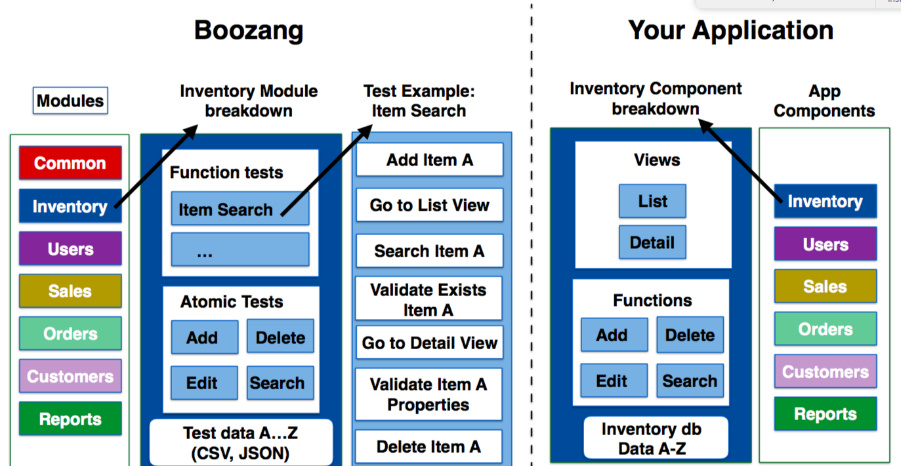

**Modules**


The modules are used to divide your tests into functional areas of your application. Where other tools usually have tests and test suites, or test suites are just another test in Boozang (using Plug test-case). Modules are used to organize tests to match the functional modules of the application. They work as folders to organize your tests, but also to allow data to be added on the module level. For instance, in the Inventory module in the example, the Test data for inventory should typically be saved as Module data. 

**Sub-modules**

For very complex applications it can sometimes be useful to introduce sub-modules. This is particularly useful when you have sub-modules on the application side. For most SaaS applications, such as CMS (content management system) or ERP (Enterprise resource planning), the application is organized in two levels, making the project-module-test hierarchy sufficient. 

### Recording your first test

Boozang works within the browser which allows for a very stable recording function. Simply click on the record button in the tool. As you perform actions on your web page actions will be recorded. To remove an un-wanted action that was recorded press the trashbin next to the action in the main tool view. 

As soon as a test has been created you can use the playback button to replay the test steps. Boozang supports four different playback modes: **Normal**, **demo**, **debug** and **automation** mode. Demo mode slows down the playback speed and annotates every test step. This is good for demos and when trying to understand a test that someone else has authored. Debug mode is a very powerful functionality that plays the test, but when encountering an error it highlights the error and allows you to correct it on the fly. When you have corrected the error, simply press the play button again and the test will continue its execution. This is very useful when updating a test after a big code change. 

A test is automatically saved in the local storage of the browser. As soon as you update a test, the test will be checked out by you, and it will appear as locked for your team-mates, which prevents them from making changes. As soon as you click save the test will be saved on the Boozang server, and the lock will be automatically removed, allowing other team members to make changes. 

**A note on Window alignment**

To use Boozang well, we recommend aligning the Boozang tool and your application next to each other side by side in the following way


This allows you to get a good overview of the recorded actions, and an easy way to modify or delete recorded actions.

### In-tool help

As Boozang is completely hosted in the Cloud it's easy to do changes and add useful features quickly. This has a huge upside as we can deploy features that customer asks for to all our customers at the same time, to the benefit of all. This also means that new things can appear in the user interface without warning, and in some cases, the documentation might not be up-to-date all the time. 

For this reason, to be able to deliver new features fast without forcing the end-user to re-learn, we added an online help function inside the tool. To activate help, click the question mark in the user interface, and click the functionality and an explanation will appear. 


In the help text, you will find an explanation of the function you selected. You will also find any related videos to that function, if available. When clicking a video link, a separate video window will appear and you will be able to follow along with the tool if needed. 

## The tool


In this section, we explain all the toolbars and controls, basically what does what. You can skip this section and use as a reference when you get stuck or have some questions. 

### The sidebar


**Boozang icon**

Clicking the Boozang icon is a shortcut to bring back the user to the project root. 

**Test Authoring View**

This is the main view to create test cases and organize them in the project tree. The test cases you create is organized into modules, to ensure maximum reusability. 

**Bugs**

Bug authoring view. Use this section to record bugs, which are most often visual discrepancies of your application highlighted by the comment function.

In this view, you have access to all authoring tools, with the difference that bugs can be assigned to other members of your team.

**Settings**

The project settings allow the user to set: Environment, Content Policy, Notifications, and Preferences.

**Reports**

The report view contains the report of the latest test run. When running a test, the user can also switch to the report view to see the report is generated as the test runs. 

**Tools**

In tools, you will find import and export tools for the project. This allows an admin user to backup projects and also to import projects from other users. There is also a powerful free-text search that can search both modules and test and data, and perform replacement as well. 

### The hamburger menu


**Management**

Takes the user to the Boozang Cloud Management interface. This allows the user to switch between projects. 

**Account**

Access the account page. Here you can see current service usage and your current license tier. 

**Console**

Opens the Boozang console. It allows the user to inspect data and trouble-shoot tests. 

**Chat & Message**

Opens a popup chat with the team. Here you can monitor project activity and chat with other project members. 

**Dock mode**

The docked mode allows the user to switch between undocked (two separate application windows), dock to left (Boozang IDE is to the left) and dock to right (Boozang is on the right). In some cases the applications under test don´t support docked mode, so use this option to Undock. 

**Video Tutorials**

This is a link to the video tutorials on the homepage. 

**Functional Overview**

This is a link to the latest version of this document. 

**Video Helper**

This opens a small helper that gives you topic-based video help based on certain topics. 

Note: Some of this video material may have been recorded on top of previous versions of Boozang. 

**Sign Out**

Log out the user. 

### The top bar


**Project Name**

The first entry in the top bar will be the project name. Clicking on the project name will take you to the root of the project tree. Use a descriptive name for your project that reflects the product under test, or for companies having a single product, the company name. 

**Module name / View name**

Clicking on the module name in the test authoring view will take you to the module level of the tree. When being in a different view than the test authoring view, the View name as given in the side-bar will be displayed, such as Settings or Report.

**Test Name**

The third level of the navigation is only displayed in the test authoring view when a test is selected. In the case of sub-modules, there can also be several intermediate levels. 

**Quick Navigation**

Use the Caret down icon to quickly switch between modules and tests. You can also create new modules, new test suites and new tests from here. 

**Search**

To do a free text search on any module or test, hit the Search icon. As you type, the matching search results will display.  

**Hamburger**

Click the hamburger icon to open the hamburger menu. 


### The action list

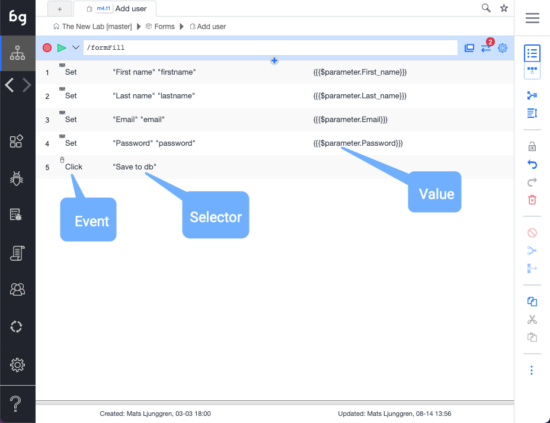

**Reload URL**

Reloads the test URL in the application browser window. Use this to make sure the correct URL is loaded in the application window, for instance when recording a new test. 

Tip: Double-clicking the test row also performs this action

**Action icon**

An icon that indicates the action type. The different action types are **Validate Result**, **Mouse Event**, **Keyboard Event**, **Extract data**, **Javascript**, **Comment**, **Refresh Window**, **Plug Test**, and **Visit Links**.  

*Tip: Clicking the action icon toggles breakpoints. Test execution is temporarily stopped at breakpoints, allowing for troubleshooting of tests. To resume playing the test, click the play button.*

**Action description**

This is the human-readable description of the action and defaults to the actual action code. If needed, this can be changed on the auction details page.

**Data Indicator**

Orange indicates that dynamic data is used. The following data scopes are available: $parameter, $test, $module, $project, $loop

**Add action in list**

Inserts an action in the action list. It´s also possible to initiate a recording that inserts actions anywhere in the list. 

**Run action**

Executes a single action. 

*Tip: Double-clicking the action row also runs the action.* 

**Custom timeouts**

Indicate that the timeouts for that particular action have been customized. This can be done by editing timeouts in action details. In the case of slow response times during recording, this will also be added automatically to ensure test stability. 

**Custom exit conditions**

Indicate that exit conditions for the action have been customized. Exit conditions signify what action is taken on a certain action outcome. Action outcomes are Success, Fail, and Error. Success means the action was executed successfully, Fail means that it executed falsely, such as validation fail, and Error means element not found. 

**Action details**

Opens the action details panel. The action details can be pinned to stay open, or always be seen at the top or base of the action list. When pinned, action details only shows the main controls. 

### Record / Play

**Recording**

To record a test, click on the record button. Boozang will now catch any action being made in the application window. To stop recording, click stop. In the case where the application window is closed, the record will open the application window at the current URL. Use the Reload URL button to make sure that the URL is set correctly before recording.

**Playing a test**

To play a test, click the Play button. To play the test from the start; make sure that the first row (gray) row of the action list has been selected as this signifies the actual test. You can also play a test from a specific action. Simply select the action you want to play from and click the Play button. You can choose to watch all the actions play and see the result in real-time, or switch to the report view to see the report being generated. 

There are several play modes available

**Play**

Plays to end. Launches AI repair if element not found, but continues after a set time. 

**Play in repair mode**

Plays the test, but tries to repair it when the element is not found.

**Play in demo mode**

Plays the test case step-by-step and highlights all actions in the application window using annotations (compare comment function).

**Step-by-step**

Plays the test one step at a time.

**Automation mode**

Emulates running the test from the command line using the Boozang test runner. After a test has been run, a dialog will show allowing the user to opt-out of the browser shut down. Running in this mode will notify all report subscribers, so it´s a good way to test email notifications.  

Running in automation mode never activates AI repair. 

### The Toolbar


**Switch view: List / GUI**

The switch view button toggles between table and diagram view.

The views are equivalent in functionality, but the diagram views better illustrate the flow between tests, while the table view displays the actions more linearly.

Tip: Use table mode for test authoring, and experiment with diagram view when executing tests. 

**Parameter**

Use this to set dynamic data used by the test, to improve test re-usability. You can set this data when running the test, and override if when calling the test from an upstream test case (using plug test-case). When doing form fills, you can also bind the form data directly into the parameter.

*Tip: Think of this as parameters/arguments to a function in conventional programming. This greatly promotes test re-use and good test automation practice.*  

**Group**

The group function group's actions together. This allows you do keep your test in order, and to skip a set of actions using the exit condition Exit Group. By using Else-group, this can be used to implement simple conditional functionality (compare: if / else)

*Tip: Use Ctrl/CMD functions to multi-select actions.*

**Generate test case**

Breaks up a group of actions into a separate test and replaces the group with a reference to that test (Plug-test case). It allows you to quickly refactor your tests to remove duplicate action sequences.

*Tip: Use Ctrl/CMD functions to multi-select.*

**Cut / Copy /Paste**

Standard Cut functionality. Use Cut and Paste to move actions between tests, tests between modules, or data between tests and modules.

*Tip: Use Ctrl/CMD functions to multi-select.*

**Undo / Redo**

Undo /Redo last un-saved action. In Boozang, you cannot undo saved changes as they have been committed to the Cloud.

**Delete**

Deletes one or several actions. 

*Tip: Use Ctrl/CMD functions to multi-select.*

**Disable**

A disabled action is skipped when a test is run. Useful to debug tests. 

### Action details
## Elements


Being able to identify HTML elements in your application is central to test automation. Boozang has a unique approach to this, so it's worth spending some time learning about it. Normally, the record function takes care of capturing elements very well, but the unique Boozang selection policy enables us to do very powerful data-driven development, where dynamical data can be used as selectors.  

### A note on element selection policy

Our element selector policy is based on natural language. This means Boozang primarily uses what an end-user sees, rather than hidden element attributes, such as `class` or `id`.  

This has the following benefits: 

- Great support for applications with dynamic classes and ids 
- Automated form fills 
- Intelligent test repairs 
- Closer alignment to requirements
- Auto-generation of tests through machine learning

**Great support for dynamic classes and ids**

By not relying on attributes like `class` or `id` by default, recorded tests are not broken when these are changed in the application. This makes Boozang well-suited for testing on top of applications with dynamic attributes. For special cases where you need to depend on `id` or `class` (such as extracting data), the user can opt-in to use these attributes.

 **Automated form fills**

It's also great to handle data. The following form example illustrates this

<form>
 First name<br>
 <input type="text" class="forminput"><br>
 Last name<br>
 <input type="text" class="forminput">
</form>

In Boozang, the element locator would be based on the strings `first_name` and `last_name`. This will allow us to automatically match the following `JSON` data

```json
{
  "first_name": "John",
  "last_name": "Doe"
}
```

This might seem like a small win, but this can make a huge difference when testing data-intense applications, and when making form fills based on spreadsheet data. 

**Intelligent test repairs**

By basing the element locators on what the user sees, tests are sensitive to updates to the element verbatim rather than other invisible attributes. This means tests often fail explicitly for changes in the UI, which allows the user to re-select the element from the tools. For instance, when a button text changes from "Create" to "Add", the next time it cannot find the label "Create", it will scan the UI for "Add" and suggest the update. 

**Closer alignment to requirements**

As the selectors are based on what the user sees, the test code will read much like a requirement. This means that tests in Boozang are closely aligned with the business domain, making it easier to create a "living document" of the code. This makes it easier to keep requirements up to date and to have a single source of truth.

**Auto-generation of tests**

With the introduction of requirements into Boozang (for instance, with the introduction of Gherkin tests), we can apply machine learning to suggest test code based on the Gherkin syntax. As the Boozang test automation language is a type of natural language, we can apply simple NLP machine learning to suggest test code without the need for test authoring. 

*A note on other machine learning tools*

It's also possible to use machine-learning on the element selectors, like

```weigh1 * .someclass + weight2 * #someid + weight3 * “Some text”```

This can give short term benefits in terms of stability, but can also introduce noise and false positives. At Boozang we believe that what has been written in a requirement (and what is seen in a UI) is the truth, not what a developer decided to put in a class or id attribute. This is why we apply a stricter element policy and action representation. By doing this, we can apply machine learning at the test / requirement level instead, resulting in higher impact on productivity and better test coverage. 

### Selecting the element

Boozang uses custom element selectors based on what a user will see rather than classes, ids or other attributes. This means that to use class or id, this usually needs to be explicitly defined. By avoiding using classes and ids as primary identifiers, Boozang tests become very stable to code changes and can automate applications with dynamic ids and classes freely.

**The element bar**

For most actions, the user can select an element (Validations, Events, Javascript and Extract Data). When recording or picking an element Boozang tries to guess the best path to the element. Usually, this is sufficient, but sometimes this needs to be edited. 

**Re-picking an element**

The first step if an action isn´t working as expected is to re-pick the element in the application window. To make sure, double-click the action and confirm that the action is working. 

*Tip: Click on the element dialog and see if the correct element is highlighted in the application window.* 

**Edit element with DOM picker**

If this is still not sufficient, you can try to edit the element. If the current element is not found in the application window, the user will be asked to pick the element. If found, the DOM picker window will be launched which allows the user to fine-tune the element path

### Understanding the DOM picker
The DOM picker allows the user to precisely specify the element selector. During recording, Boozang will under normal circumstances be able to guess the best unique element path. In some cases,  it´s desirable to override the predetermined element path.  

Common cases when the element path needs to be changed

**Wrong element picked**

When clicking on the element, if the wrong element is highlighted, this means the path isn´t good. Try picking the element once more using the "Select element path" button. If the problem is still there, edit the element path by clicking the "Edit element path" button. This will open the DOM picker and allow you to adjust the policy for how the element is selected.

**Element index > 0**

If the element index > 0 it means that the element isn´t uniquely identified. This will be indicated by a warning. Use the DOM picker to make sure the checkbox icon turns green (meaning element index ==0).

**Extract data**

When extracting data, the data itself should not be used as an element selector.  Use the DOM picker to the key of id or class, or other attributes.


**Element path operation**

The element path has the following operations. Boozang uses an expanded version of the jQuery selection standard to create a more human-readable code to identify elements. The basic pattern is that the lowercase jQuery standard operations, while uppercase operations are case-insensitive. All recordings will generate Uppercase operations by default. The operations that will be recorded for a test-case is marked by an asterisk (`*`) 

`endContains (*)`:  Is true if the selected element (case-insensitive) have the exact string alongside other strings

  ```
  Ex:div:endContains(lws)
  Yes:<div>lws ok</div>
  No:<div>lwsok</div>
  Yes:<div>lws <span>ok</span></div>
  No: <div><span>lws</span></div>
  ```

`endEquals (*)`: Is true if the selected element (case-insensitive) have the exact string

  ```
  Ex:div:endEquals(lws)
  Yes:<div>lws</div>
  No: <div>lws ok</div>
  No: <div>lwsok</div>
  No: <div><span>lws</span></div>
  ```

`equals`: Is true if the selected element or any of it's children (case-sensitive) have the exact string alongside other strings

  ```
  Ex:div:equals(lws)
  Yes:<div><span>lws</span></div>
  No: <div>lws ok</div>

  ```

`Contains (*)`: Is true if the selected element or any it's children (case-insensitive) have the exact string

  ```
  Ex: div:Contains(lws)
  Yes:<div><span>LWs ok</span></div>
  No: <div>lwsok</div>
  ```

`contains`: Is true if the selected element and all it's children (case-sensitive) matches

  ```
  Ex: div:contains(lws)
  Yes:<div><span>lws ok</span></div>
  Yes:<div>lwsok</div>
  No: <div>lwok</div>
  ```

`RowCol (*)`: Used to identify table cell (case-insensitive).

  ```
  Ex: td:RowCol([value|name])
  Yes:<tr><td></td><td>NAME</td></tr>
      <tr><td>VALUE</td><td>1234</td></tr>
      
  No: <tr><td></td><td>name</td></tr>
      <tr><td>value1</td><td>1234</td></tr>
  ```

`rowcol`: Used to identify a table cell (case-sensitive).

  ```
  Ex: td:rowcol([value|name])
    Yes:<tr><td></td><td>name</td></tr>
      <tr><td>value</td><td>1234</td></tr>
      
  No: <tr><td></td><td>name</td></tr>
      <tr><td>VALUE</td><td>1234</td></tr>

  ```

`near (*)`: Used to identify form input box based on labels (case-insensitive). The rule to match the first element before that share a common parent element.

  ```
  Ex: input:near(name)
  Yes:<div><label>name: <input/></label></div>
  Yes:<div><label>name: </label><input/></div>
  Yes:<tr><td>Name</td><td><input/></td></tr>
  No: <div>name</div><div><label>value</label><input/></div>
  No: <div><div>name</div><div>value</div><input/></div>

  ```

### Element policy

Under the kebab menu, you can also access the element policy. 

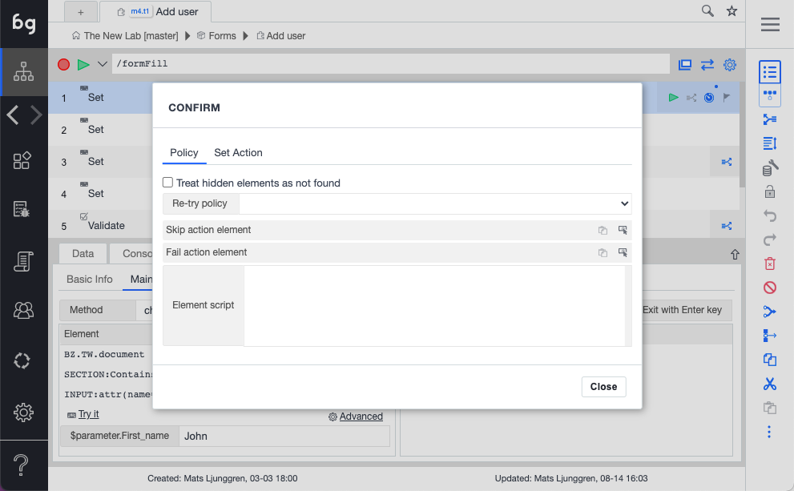

**Treat hidden elements as not found**

Normally, hidden elements can still be clicked programmatically. Check this box to trigger Error ()"element not found") when an element is hidden. 

**Element re-try policy**

The default behavior is to **Re-try on element missing**. Customize this to **Never re-try** or **Re-try on content mismatch** (re-tries when an element is found but the content is wrong).

### Repairing an action


When a test is run and an action element cannot be found the AI test repair screen will be launched. This will allow the user to re-pick the element from the application window. If a matching element is found, Boozang will suggest the element for the user. This allows the user to repair tests ultra-fast even when there have been significant code changes.

*Tip: In normal play mode, the user is asked if the test should be repaired. In Repair mode, the AI repair is always launched, and in Automation, mode AI repair is never launched.* 

## Actions


Actions are the steps that comprise a test case. This could be a mouse or keyword event, simulating a user action, or a validation (assertion) or even Javascript. There are also AI actions supported which are more elaborate actions such as "Visit Links" or "Form Fill".

### Events

There are three types of events supported in Boozang: Click, Keypress, and Change. These are fairly straightforward, but not obvious which event will be captured during a recording. See below list of events that will be generated for different recording scenarios.  

- Click events: Generated when clicking buttons or page elements. Not generated when clicking inside a form or on a checkbox. 
- Change events: Generated when filling inputs in forms and clicking mouse, tab, or enter
- Key events: Generated when pressing keys in special circumstances. 

This might seem contra-intuitive, but guarantees that form fills are recorded as stable as possible. Usually, regardless of user habits (using mouse or tab key), forms should be recorded the same way. 

**Mouse click events**


This event corresponds to a mouse action, meaning a click or a movement of the mouse. By default, Boozang captures on clicks in the recording (otherwise the recording becomes very noisy catching too many events). The exception to this is when holding the mouse button down, to emulate drag and drop. In this case, Boozang registers a particular drag-and-drop event.  You can add mouse events manually to emulate mouse-over events and to create specific mouse conditions. 

*Advanced*

Here you can add additional validations as a post-condition for an action. 

**Change events**


The change event is used to record state change in forms and checkboxes. When filling a form field, the data will be shown in brackets, like

`(John Doe)` or `($parameter.name)` or `($test.name)`

If a checkbox is clicked, the `Value` will be set to 


**Key events**

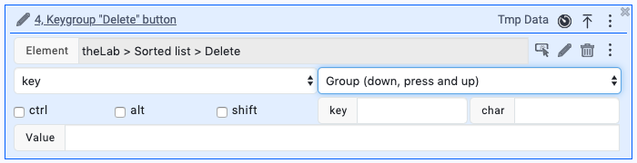

This event corresponds to a keypress. This is captured in the recording for every time a key is pressed. The default recorded keypress is `Group` which will generate the following Javascript events: `keydown`, `keypress` and `keyup`, in that order. You can change the drop-down to generate a specific event only. 

You can also generate a special key or char code by clicking the field and clicking the keyboard button. 

### Validations

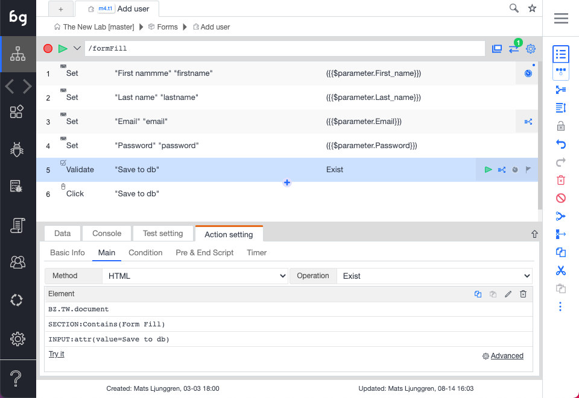

**Creating a simple validation**

In a test, it´s common to make sure that a certain outcome is achieved. In Boozang we do this using validation, also known as assertions. To create a validation, click on the validation icon and select the element to validate it in the application window. The default validation content format: "validate exists" will be created. If you want to change the validation content format you can do this using the dropdown in the tool window. 

**Content formats**

The following content formats are supported

- Exists (default): Validates if an element exists. It generates a success condition if the element in the path exists, and a fail condition if it doesn't exist. 
- Not exists: Opposite to Exists. It generates a fail condition if the element in the path exist, and a success condition if it doesn't exist. 
- Dynamic Exist: ????
- innerText: Used to do String comparisons of the innerText content of the element. It generates a success condition if match, a fail condition on mis-match and an error condition if element doesn't exist. 
- Input value: Used to do String comparisons of an input box. It generates a success condition if match, a fail condition on mismatch and an error condition if element doesn't exist. 
- Is Enabled: Check if an element is enabled. It generates a success condition if the element is enabled,  a fail condition if the element is disabled, and error if the element doesn't exist. 
- Is Disabled: Opposite of Is Enabled. It generates a fail condition if the element is enabled,  a success condition if the element is disabled, and error if the element doesn't exist. 
- Is Checked: Checks if a checkbox is checked. It generates success if the element is checked, fail if the element is unchecked, and error if the element doesn't exist. 
- Screenshot: Does a pixel-by-pixel comparison of an image. After an element has been selected, a checksum is generated of the image content. This action will generate success if an identical image is found at the element location and fail otherwise. An error will be generated if the element doesn´t exist. 
- Data: Check an element if it contains a set of data. The data expectation can contain several data entries. It generates success if all data is found in any order, fail if any data is missingm and error if element doesn't exist. Powerful to check if a table or list have a certain data entry. 
- Script: Write custom validation using Javascript. Generates success if true is returned and fail if false is returned.
- Request/Reponse (API): Does a validation on an API end-point. See section for API testing. 

As you can see, a lot of these commands have three expected results: Success, Fail, and Error. Note how Exists and Not Exists should only be able to return Success or Fail.

**Compare**

This is the comparison operator. The following operators are self-explanatory

- Equals (==) and Not Equals (!=).
- Greater-than (`>`), Greater-than-or-equals `>=`).
- Lesser-than (`<`), Lesser-than-or-equals (`<=`).

and these are a bit more complex

- regex: Allows you to put a regular expression in the Expectation field
- Include: Checks for any occurrences of a String. It generates success if it finds a match, fail otherwise. If the element doesn't exist, it generates an error.   
- Exclude: Opposite of Include. It generates fail if it finds a match, success otherwise. If the element doesn't exist, it generates an error.   

**Expectation**

This is the comparison value to use. This could be a string or regular expression (in the case of the regex operator). 

*Advanced (accessible from kebab menu)*


This is used to pre-process a validation and is useful when filtering out dynamic data. 

Imagine the following example: 

```html
<div>
  The date is 2019-09-12 and I'm feeling good.
</div>
```

In this case, it would be desirable to validate the message itself and that any date is shown. By setting `Match` to `^(0?[1-9]|[12][0-9]|3[01])[- /.](0?[1-9]|1[012])[- /.](19|20)\\d\\d(?:,)$` and `Replacement String` to `YYYY-MM-DD`, the resulting validation can be done using equals, like

```html
<div>
  The date is YYYY-MM-DD and I'm feeling good.
</div> 
```

**Javascript validations**

The default validation is HTML validation. By changing the method to "Script", you can directly do validations using Javascript. The Javascript function is written in the standard Boozang format

  `(function(){
    //return true/false;
    })()`

and must return true or false. If an element has been picked with the DOM picker this will be available using the handle `$element`. Standard data handles, such as `$project`, `$module`, and `$test` will also be available, as well as the test window handles `$TW`. For more information about data see <a href="/doc/data.html">data</a> section. 

### Extract data

Note: For API versions of these actions check the API section. 

This is used to extract data from the application window and put in a data vairable. 


**Default behavior**

When you add an extract data actionm you'll be prompted to select something from the application window. As you can see from the example, data is extracted the following way

```javascript
$test.tmpValue=$element.innerText.trim()
```

This is just an example to help you along. If you have your own data variable, for instance `$project.myHappyData` you can simply replace the code in the `Extract Data` field.

```javascript
$project.myHappyData=$element.innerText.trim()
```

**Dynamic data and element selector**

When selecting some data in a page that is dynamic, such as a database id or project name, it's important to pay special attention to the element. By defaultm Boozang natural language selectors will try and identify the element by the actual text, which would be changing, generating an element not found error. 

Here it is needed to click on "Edit element" icon to open the DOM picker, and explicitly choose a selector that doesn't contain the dynamic data. In the example below, `tiger` is the dynamic data that was highlighted by default. To extract this data, we have instead chosen to use a selector based on the attribute `class` which should be equal to `string1` (denoted with Javascript shorthand below as `.string1`). t

 

### Javascript


**The Javascript action**

Boozang also allows you to execute Javascript directly in the application. This can be very useful when trying to do more advanced things that aren't covered by the set of actions Boozang has out-of-the-box. 

**Reference Data**

When writing Javascript there are some particularities in Boozang that need to be respected. To access the application window, you will have to use the handle `$TW (test window)`. This means to be able to manipulate the application window document tree (DOM) the user needs to use `$TW.document`. When referencing the only document it references the Boozang tool window, not the application window.

In Boozang you can reference data directly in Javascript. To access data, use the handles `$project`, `$module`, or `$test`, depending on what level the data was added. For instance, to reference a username that was added on the module level, use `$module.username`. 

**Function**

Boozang also supplies pre-made code snippets for the following common scenarios. 

- Load page
- Browser back, Browser forward
- Scroll to Top, Scroll to Bottom, Scroll one page down and right, Scoll one page up and left
- Retrieve URL

Use these as-is or as starting points for you own custom Javascript commands. 

**Trouble-shooting**

To troubleshoot the application it's sometimes useful to add debugging code. For instance, to write the contents of the module-level data "username" use `console.log($module.username)` to write it to the tool window and `$TW.console.log($module.username)` to write it to the application window. You can use the Chrome developer tools to easily verify this.

*Tip: Avoid using `$TW.alert()` as Boozang interprets this as application popup windows and intercepts them.* 

### Comment


**Why use comment?**

In a lot of cases, some errors can only be spotted by a human, such as a look & feel bugs or poor choice of language. In this case, it's very useful to be able to point this out and have a simple way for a team member on the receiving side being able to correct this. For these cases, we use the Comment action. 

**The Comment action**


The comment actions add a comment, or annotation, to the application. To add a comment, click on the Plus icon and select Add Comment, and select the element in the application page to Comment. You can write directly into the Comment dialog on the application.

**Running a test with comments**

When running a test with comments, the test will execute and stop at the first comment. To go to the next comment, press play again and the test will continue executing until it finishes or hits the next comment. This is very useful when fixing look & feel issues, as several issues can be recorded in the same test case. 

**Show selection for Pass/Fail**

Sometimes it's nice to create a checklist for a manual tester to be guided through the application. You can use the Comment action to ask questions to the user and generate success or failure code based on user inputs. Simple click the "Show selection for Pass/Fail" to generate this kind of interactive comment. 

### Refresh window/Load page


The refresh window/load page action is used to force a reload of the browser window. This can also be used to force loading a new page (meaning going to a new page without having to navigate to it). There is also an option to **Clear Cookies** and **Clear Localstorage**.

**Note**: There are security limitations for what a browser allows being deleted. For instance, the browser does not allow session cookies to be deleted, so this cannot be triggered by the Boozang tool.

### Visit Links


The visit links action is used to automatically crawl a set of pages based on a navigation bar. To crawl a full navigation panel, such as side navigation or hamburger menu, select this in the **Panel** option. **Target element** defaults to "A" tags but can be changed using the DOM picker in case the navigation contains a different element than regular links. It's possible to execute a script before each click, but this can normally be left blank.

For each click, it´s normal to call a test case. Use **Goto Test Case** to select a downstream test case. This test case will be called for each link in the selected navigation panel.

## Using data


Data is used to be able to create data-driven tests. This means that a test that takes data as input (for instance "Login" or "Create Project") can be re-used for different data sets. Data handling is at the core of Boozang, and a large variety of data types are supported. 

### Introduction to data types


Boozang supports several different data types: Property, Object, Array, CSV, File, Request data and JS (Javascript function). 

**Properties**

The property is a simple name-value pair and can be referenced directly. For instance, a property username = boozang added on test-level, can be referenced `{{$test.username}} (=boozang)`. 

*Tip: You can verify this in execution by printing it to your application console window by creating the following Javascript action` $TW.console.log($test.username)`.*

**Objects**

Objects in Boozang are the one-level sub-set of JSON objects and are ideal for grouping related data together. For instance, create the Object loginInfo and add username = boozang and password = p@ssw0rd. The data can be referenced by typing `{{$test.loginInfo.username}}` and `{{$test.loginInfo.password}}`.

**Array**

The arrays are great for storing a list of items. 

Tip: Arrays can be used to drive data loops

**CSV data**

CSV data allows you to handle a large collection of Objects and copy data from software such as Excel. Create a name for the collection, such as inventory items. Start by adding the field names as headings separated by tab-spaces. When you are done defining the data hit Enter and fill out the values tab-separated. Pro-tip: You can copy a whole table from Excel by using copy-paste. 

*Tip: CSV data can be used to drive data loops.* 

**File data**

File data is used to test file upload and similar user interactions. Try and use small sample files as large files tend to weight down on the test client, consuming memory or slowing down performance. It is also recommended to fetch files from an external source (see Request Data). 

**Request Data**

It is also possible to fetch data from an external source. Simply type in a URL and choose CSV, JSON or File. The CSV file should be comma-separated (`field1name1, fieldname2, \n value1, value2`) and not tab-separated. 

**JS (Javascript functions)**

It is also possible to specify Javascript functions directly. The functions can be in two forms: Date.now() or fining the data hit Enter and fill out the values tab-separated. 

*Tip: You can copy a whole table from Excel by using copy-paste.* 

**File data**

File data is used to test file upload and similar user interactions. Try and use small sample files as large files tend to weight down on the test client, consuming memory or slowing down performance. It is also recommended to fetch files from an external source (see Request Data). 

### Data binding

**A note on form fills and data**

When recording a test, any data entered into a form will be recorded as well. Usually, this will happen when pressing enter, tab key or when using the mouse to click the next field or submitting the form. Sometimes it's sufficient to record a test with a certain hard-coded set of data. More often, it´s desirable to capture data into variables so that the test can be re-used for several different sets of data. Boozang makes this very easy to do.  


**Binding from forms to data**

One way of capturing data into variables is to start on the application side. When entering data into the form, click the "Bind data" checkbox in the toolbar and select the data scope you would like to capture the data. While typing, you can see that you are prompted to save the data in a variable. When you fully typed out the field, click the desired field name and you the data will be saved at the appropriate data scope that you selected.


**Binding from data to forms**

There is also a different way to fill the data. Start by entering the data (normally as a JSON object) and after this click the "Bind data" checkbox and select the data scope where you entered the data. When starting typing you can see that the data in the data scope is suggested to you. Click on the suggested data, and it will be automatically typed into the form for you, and bound into the event action.

**Auto-filling forms from data**

As you can see, any data key names that correspond (matches case-insensitive / white-space insensitive) to the form labels will be suggested when binding data to forms. If you have organized your data well and made sure all data keys match the form labels, you can click the Autofill-link and all the form events will be generated automatically.

*Tip: This can greatly speed up test creation of form fill tests, so try and learn this naming convention.*  

### Defining regular expressions


**Boozang regular expression engine**

Boozang also supports a regular expression engine that can generate random data that complies with a certain regular expression. This can be useful when generating random test data, but also when creating tests to make sure certain field constraints are being enforced. 

**Setting up regular expressions**

To set up a new regular expression, click Settings -> Content Policy and scroll down to the regular expressions. Here you can find several pre-defined regexps and associated labels. First, make sure the type of regular expression isn´t in the list. As a phone number or zip code will vary from country to country, it´s natural that these are modified to match your specific project. 

Also, make sure that all possible labels are matching the indicated regular expressions. This way, auto-fill functionality and future AI functions will be able to better identify different fields and make "better guesses".  

**Setting up a new regular expression**

To set up a new regular expression, click new and add in the necessary fields. The Field mapping will determine which form labels to look for when trying to match data. Use the OR sign ("|") to separate several fields. 


**Using auto-fill functionality**

When using the auto-fill functionality in the toolbar the Boozang tool without choosing to data-bind, Boozang will use the regexp engine to generate data into the form. When recording this can be used to quickly create test cases with temp data. 

**Binding auto-fill with data-bind**

When enabling data-bind and clicking autofill form, Boozang will look in the current data scope for matching data. If that isn´t found, Boozang will use the regexp engine to generate the data in the current scope, and automatically bind the data scope to the form. This is a great way to quickly create a data-driven test case.

*Tip: Using autofill with data-bind on `$parameter` scope is a quick way to create a very versatile  data-driven test case.* 

### Pre-defined regular expressions

There are also pre-programmed regular expressions in Boozang that can be used. Here is a list of teh current ones.

**Data formatters for date and time**

For data and time date, the default data format is `YYYY-MM-DD`, meaning that for 26th of November 2019, `/{today}/`will output `2019-10-26`. You can also input a data formatter separated by a pipe `|`character. Here are some examples,

- No formatter: `/{today}/`outputs `2019-10-26`.
- With minutes and seconds dot-colon-notation: `/{today|YYYY.MM.DD:mm.ss}/` will output `2019.10.26:30.29`
- Only month and day:  `/{tomorrow|MM-DD}/`outputs `10-27`

**Date and time**

The following pre-defined expressions are available. All examples are based on today being Saturday October 26th 2019. 

-   `/{today}/`outputs `2019-10-26`
- `/{yesterday}/` and  `/{tomorrow}/`and outputs `2019-10-25` and `2019-10-27`
- `/{today-7}/`outputs `2019-10-19`(last week)
- `/{last-mon}/` and `/{last-tue}/` outputs `2019-10-14` and `2019-10-15`
- `/{last-month}/` outputs `2019-09-26`(this date previous month)
- `/{last-year}/` outputs `2018-10-26`(this date previous year)

### Troubleshooting data

**Console window**


When running a test it is sometimes desirable to inspect the data that is being run. In many cases, upstream test cases are sending data as parameters, and it gets even more tricky when data is being loaded from external data sources or Javascript functions. To inspect the data that is being used, you can use the console window. This window is located in the hamburger menu and allows users to spy on data.

The console can be used to check the following data:

- Assigned data: `$parameter`, `$test`, `$module`, and `$project`
- Loop data: `$loop`
- Regexp data generators: `/[a-z]{3,10}@bzmail[.]com/` (email),  `/[A-Z][0-9][A-Z] [0-9][A-Z][0-9]/` (Canadian zipcode)
- Complex data generators: `/{today|YYYY-MM-DD}/`, `/{tomorrow|MM/DD hh:ss}/`


**Tmp data**


There is also another way to inspect data and do more advanced troubleshooting. For each action, in the action details menu, you can find a link called "Tmp data". This data is updated every time a test is run and will show the data that was used when the action was run. This also allows you to keep the last input data that was used, and replay the action with this data.

To inspect data during a run, add a breakpoint to the test or pause the test case during a run. Click on the action that uses the data, and click "Tmp data" in action details. 

To re-run the action with the data that you see in the "Tmp data" window,  check the checkbox "As initial data for playing the action". To keep this data (not override the data in the next run) hit the "keep" button, and the data will be saved in the keep tab. 

*Tip: Hit keep and Save to save the action data in the database to troubleshoot with other team members.*

## Settings


Settings allow you to customize Boozang to work with your application. It also allows you to set your personal user preferences. "Content-Policy" and "Element Definitions" are somewhat complex, but can be potentially very helpful for more complex testing scenarios. 

### Environment


In the Environment tab, you can find several useful functionalities. You can manage environments and different application interfaces, configure settings on an application interface level and also setup AI login/logout for different roles/users.

**Enviroment and application interfaces**

There has been some confusion around environment and application interfaces, so it's important to make sure you get this right as it will save you potential work in the future. Environments signify an environment, such as *development*, *staging*, *QA* or *production*. By specifying different entry URLs for these environments test become completely re-usable. This means there is no need to maintain different tests or projects across different environments. Simply change the environment setting and re-run the same test.

The application interface setting handles when there are different applications within the same environment. For instance, in the E-commerce case, there might be a *storefront* and a *mgmt* interface. When creating a test, pick the interface that the test is for. If this changes during the project, it has to be changed in one place, not across several tests.

**Advanced / Configure**

This setting allows you to configure certain things on an Environment / App interface level. These settings will typically be things that could vary across environments, such as delays and other performance-related settings. 

**AI login / logout (Authorization Setting)**

This allows the user to define several user roles, and automatically generate the login and logout scenarios for these roles. The user roles can be set as pre-requisites for tests, automatically switching between users. For more information, read more under the **Model-based testing** chapter. 

### Content-policy

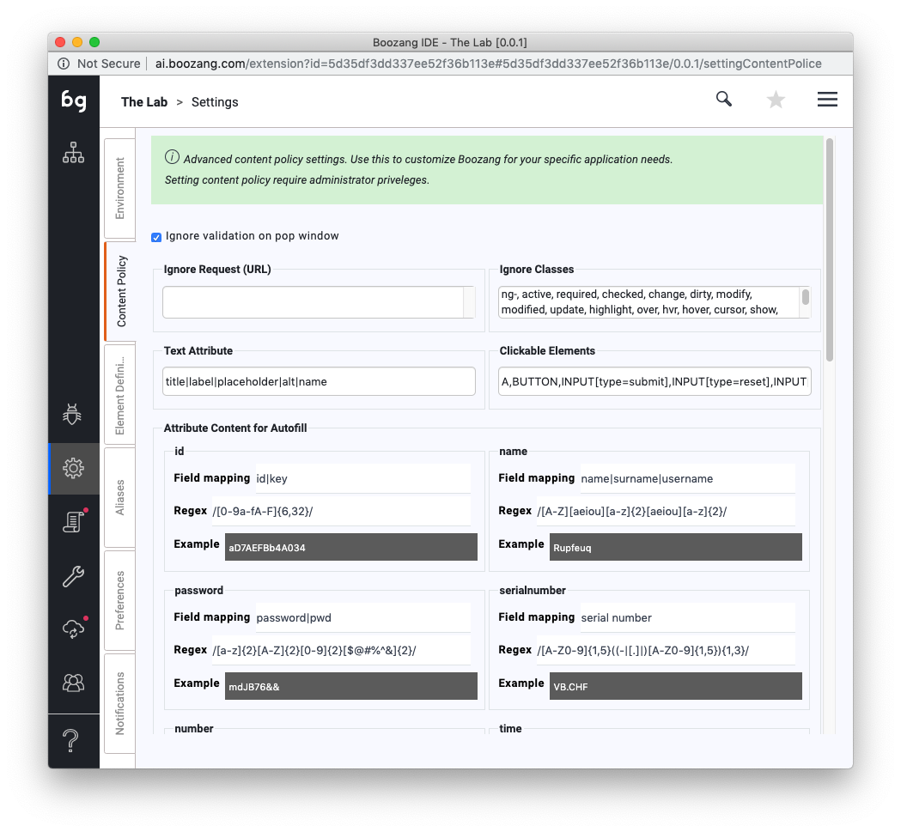


The content policy contains several advanced features. Nevertheless, spending some time here to fine-tune the project can increase the stability of tests and also speed-up test creation significantly.

**Ignore validation on pop window**

When checked, any pop windows (alerts, prompts, confirm pop up dialogs) will not be verified by Boozang. When un-checked, Boozang will add an assertion during recording based on pop windows that appeared. On playing back the tests, Boozang will make sure that the same pop windows appear as during the recording, and fail the test otherwise. 

**Ignore Classes**

Normally when clicking or asserting an element, classes are ignored. There is also an explicit setting for you to highlight your dynamic classes to make sure it´s ignored. 

**Text Attribute**

**Clickable Elements**

List of elements that are clickable in your application. Add elements here to be able to easily capture clicks on these elements during recording. 

**Attribute Content for Autofill**

Use this to set regular expressions to be used for content generation. 

### Element Definitions

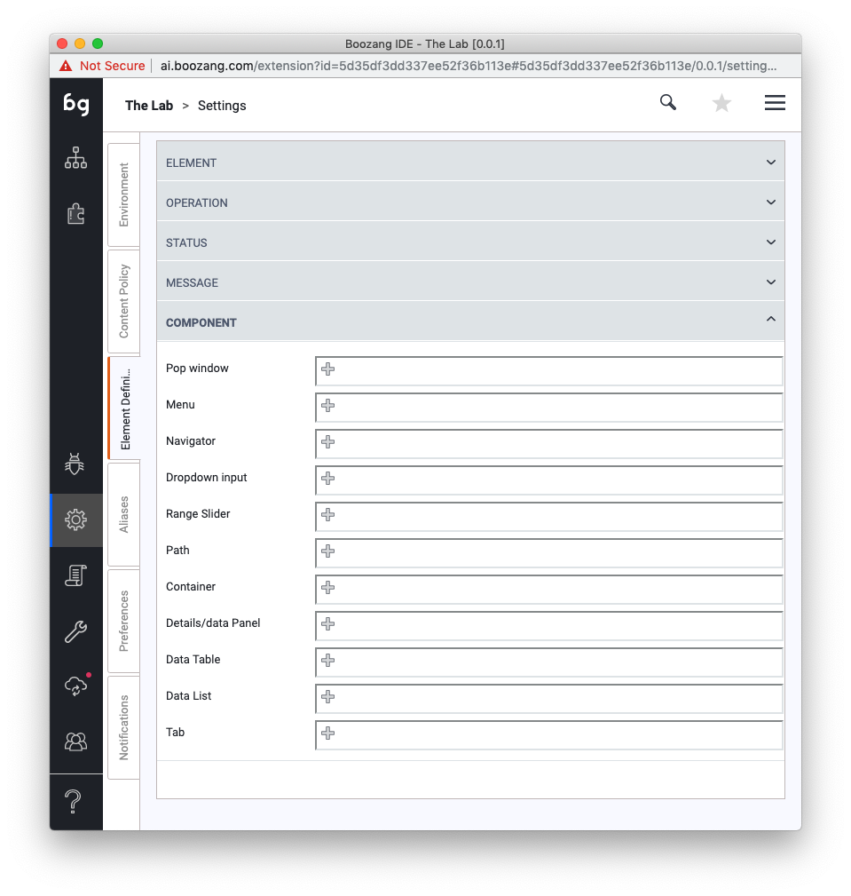

Element definitions contain the classification of all elements in the customer applications. This is mostly used for the model-based test generation. See chapter on model-based test generation in a later chapter. 

**Customize Input Component**

Use this to record customized input components. This will allow you to capture customized drop-down and special controls, such as date-pickers.

*Tip: After setting up a date-pickers,t his can be recorded as a single action, and data can be used in the format you specify (for instance: YYYY-MM-DD).*


### Aliases


Aliases are used to define shortcuts to certain test suites. This is most often used to be able to easily control which tests are being run, without having to update any upstream services, such as CI servers or similar. 

Image the scenario where you have a CI server that runs smoke-tests, regression tests, and full product tests. Now it's simple to define the aliases "smoke", "regression", and "full" and point these aliases to the tests in question. If you want to try to temporarily switch any of these aliases to run a  different test suite this can be done without updating anything on the CI server.


### Preferences


This controls individual user preferences. These settings will only apply to your user and not to the project as a whole. 

**Accept to be monitored**

Functionality to allow other users to see all work done by the user to be monitored by another team member. 

*Tip: This can be used to display the CI server runs on a dashboard*

**Disable alerts for load file errors**

Do not show any popup warnings for external files that cannot be loaded.

**Disable alers for AI repair (on test execution error)**

Don't show AI repair dialog when the element not found.

*Note: This will never be shown when running in automation mode.*

**Disable alerts for un-saved data**

Never show save test case dialog when leaving a test with un-saved data.

**Auto data-bind**

When enabled, data-bind will be enabled by default. 

**Auto insert data validation**

This still exists. 

### Notifications


This view allows a user to set up email notifications for a report. It means that every time a test is run from the command line any users that have subscribed to notifications will receive the report in his/her mailbox. To test out the notifications from the tool, make sure to run the test in Automation play mode. This will trigger the notifications.

*Tip: A user can only set up his/her won email notifications. This allows team collaborators to opt-in and opt-out from report emails, and prevents un-wanted spamming.*

## Other tool views

### Reports


**The report view**

The main report view contains the report from the test that was run in the browser last. The report view reflects only local runs of the test and is not in any way a consolidated view of reports (this consolidation can be done in a data warehouse or CI server). 

**The view link**

To find tests quickly, click the View link to go to the test. This is especially helpful when the testing report has been sent via email. 

**The diff link**

If an assertion fails that have content, such as Validate -> innerText, you can use the diff link to see the difference in content between the reference and resulted response. For dynamic data, hover over the name to see the values that were used. 

**Performance warnings**

To highlight slow actions or tests, this can be done under Environment -> Advanced -> Performance Reminder. Here you can adjust settings than can trigger slow tests to trigger warnings or even fail tests. 

### Team


**Adding team members**

It's quite straightforward to add a team member to the project. Any team members email you add will receive an email notification to join the project.

**Access policy**

Not all users are created the same. To learn about the details of the access policy check out the management interface at https://ai.boozang.com and check the project details. Here you can get a breakdown of the detailed access policy and also customize a role.

**The CI user**

Sometimes it's useful to create a CI user with only execute privileges. This way, anyone with access to the CI server will be limited to only run tests, not edit tests or invite other team members.

Tip: It's highly recommended to create a CI user with limited privileges and use the CI user token to run tests from any CI server. This will minimize any potential security problems or web socket conflicts. 

**Chat**

There is also project collaboration built-in. Use this to communicate with team members and see test updates as they happen in the project.

*Tip: This will also be used to link to Slack updates (Roadmap).* 

### Synchronize

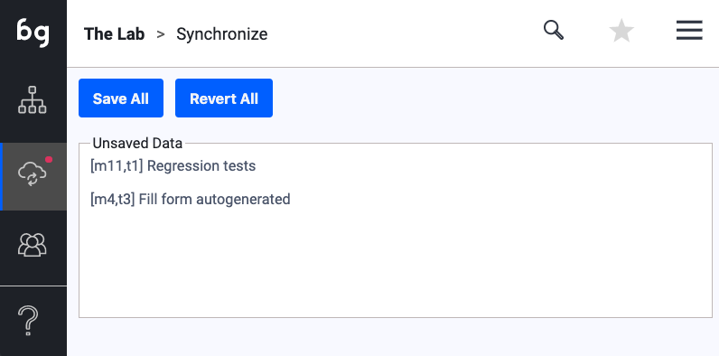

Use this function to see all local updates (the difference between your local storage and what is saved on the cloud storage). This allows you to save all changes in bulk, or revert or local changes.

### Tools

Tools contain a function to import and export a project and to do bulk operations. 

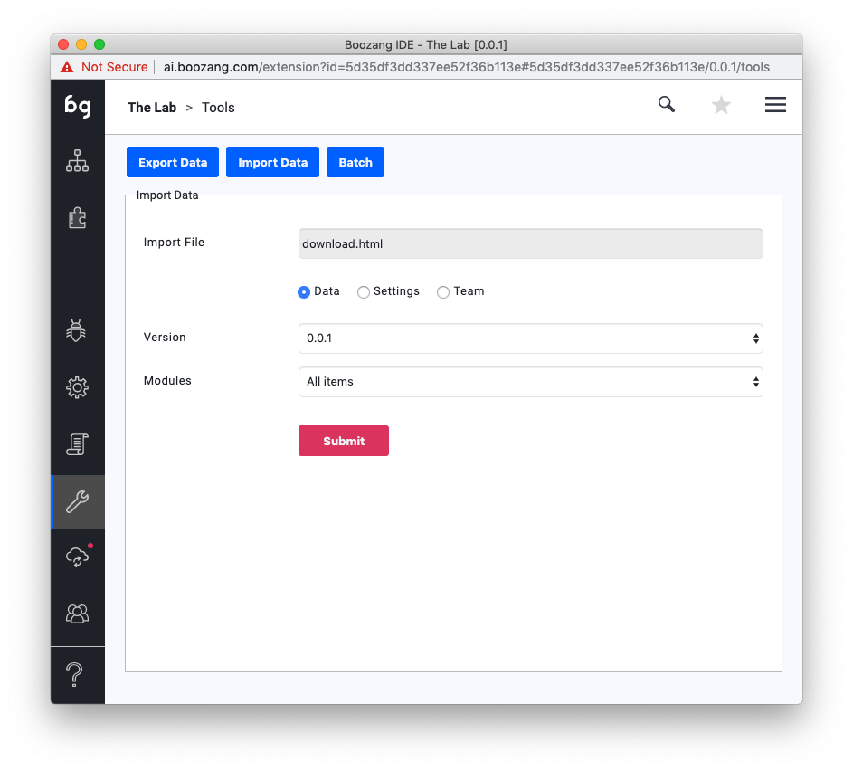

**Import**

This is used to import a project file that has been generated using the Boozang export function. This is useful when restoring a backup, or replicating a project.

Note: Before running the import it's best to clear the existing project, meaning delete all modules. 

**Export**

Use this function to export the whole Boozang project to a data file. This project export file can be saved on disk or in a secure location and restored using the import function. This can be used to back up a project, create a project duplicate, or share a project with Boozang support.

**Batch**

This powerful wild-card batch operation is used to search both for projects, modules, tests, and data. Useful for large projects to locate lost data and for doing quick project cleanups. 


## Advanced testing methods


### Data Loops

A loop means to repeat execution until a certain condition is fulfilled. In Boozang, a data loop is like a for-condition running over a data set, meaning the test gets executed once for each data entry. 


To set a test to loop over a set of data (to repeat it's execution for each data entry) click on the first line of the test (denoting the test settings) and click the Kebab icon -> Advanced. In "Loop data" select the data you want to loop over. The test will be run once for each data entry, and the current data entry will be available in the `$loop`handle. 

The following data formats are supported to drive loops

- CSV: The assigned `$loop`item will be of `Object` format (JSON) 
- Arrays:  The assigned `$loop`item will be of `Property` format (String) 
- Request data: This is supported if the fetched data is `CSV`or `Array`.

### Matrix testing

**Keywords: bz-skip and bz-stop**

In data-driven testing, we support the keywords "bz-skip" and "bz-stop" to be able to trigger conditional functionality based on data. As soon as "bz-skip" occurs the test will skip without generating a failure. If "bz-stop" occurs the all upstream tests will stop without generating an error.  


### API testing


Even though Boozang is mainly a UI testing tool, it also supports full API testing (compare Postman). This can be especially useful when creating mixed API and UI tests, doing extra validation, or pre-testing features that haven't been fully built.  

### Validate API call

**Useful resources**

To mockup a REST server, we strongly recommend https://github.com/typicode/json-server that allows you to create a fake REST API from a JSON file in less than 30 seconds. 

**Introduction to API validations**

The API validation is very similar to an HTML validation except that the validation is done towards an API end-point. Click on the Plus-sign and choose "Validation", and select Request/Response (API). In action details, you can now input the API end-point URL and HTTP method (GET, POST, DELETE, etc.).

**Doing HTTP GET validation**

Use the HTTP method GET to validate a response from a REST API. Select the HTTP method GET and enter the end-point URL. Click Play on the action to automatically populate the expectation value. 

**Doing an HTTP GET without validation**

To trigger the HTTP GET without validating the result use a comparison operator to "regexp" and set the expectation field to `.*`. 

**Adding custom headers**

When doing API calls, commonly, you need to add custom HTTP request headers. To do this click HTTP header and add header data. This needs to be in data format, i.e.

{
  Accept:"json"
}

**Doing HTTP POST validation**

You can post data to an API end-point using the HTTP method POST. When doing this make sure to add the POST data to the HTTP data field. 

**Data**

In all these fields you can also bind data. As an example, to set headers as data this can be done as an object, for instance, "jsonheader", "Accept", "json". To reference it on the actions-details use {{$test.jsonheader}} in the header field. 

### Extract data API call

**Similarities with Validation**

Extracting data is identical to API validation except that the returned response will be saved in a data variable. Make sure to familiarize yourself with the API Validation action before reading this section. 

**Introducing data**

Start by defining a data variable in the data tab. For extraction of API data you typically want to use an Object. The Object can be defined on the project, module, and test level. Add it to the test level if the data will only be used in the test case. Add it on module level if the data will be used across different tests in the module, but not on different modules. Add it on the project level if it will be used globally. 

**Assigning data**

The result will be contained in the $result variable. To assign the API response to test data called "dummy" write the following in the Extract Data window

$test.dummy = $result

**Data Conversion**


**Extracting data action**

To add an extract data action, click on the Plus icon and select Extract data, then click on an element in the application window you want to extract. 

## AI authorization

In application testing there will be a need to establish pre-conditions. In most SaaS applications this is a matter of determining who is logged in. Instead of relying on trying to mimic users by spoofing cookies or other tricks, it can be done by recording the login and logout sequence of users and being able to automatically shift between users.

### Setting up

A key in this procedure is to have login credentials for the different roles that have access to the application, and record a single login/logout sequence for that user and find an identifier for who is logged in.

**Enabling AI authorization**


Launch the authorization wizard by clicking **Enable AI authorization** when setting up the environment. 

### Authorization settings


This will open another scren that allows you do enter credentials

**Mapping module**

The name of the project module where the auto-generated login and logout cases will be stored.

**sign in(test-case)**

The name of the sign in test case

**sign out(test-case)**

The name of the sign out test case

**Mapping data**

The name for the data to map login credentials

**Role table (Unique key)**

Set a unique key for the user

**Username**

The username that is used in the login procedure

**Password**

The password that is used in the login procedure

**User identifier**

This field is used to uniquely identify the user. This can be an identifier visible right after login, such as the first namem a user id, or email address of the user. This is used to determine which user is logged in, and drives logic for switching between users/roles. 

### The authorization wizard


As soon as you click the button "Save & generate test-cases" the test-case generation wizard is launched. The normal procedure is to start by generating "sign-in" but you can also start with generating "sign-out". 


**Generating: Sign in**


1. Make sure to be logged out and navigated to the login page. Click Confirm. 
2. Click the record button and record the login procedure. Make sure to utilize the data set in the Authorization settings screen - otherwise, the data will be hard-coded.
3. Click the selector button to find an element that uniquely identifies the user. 
4. Click "optimize the test case".
5. The sign-in test case has now been generated for all users in the list. 

**Generating: Sign out**

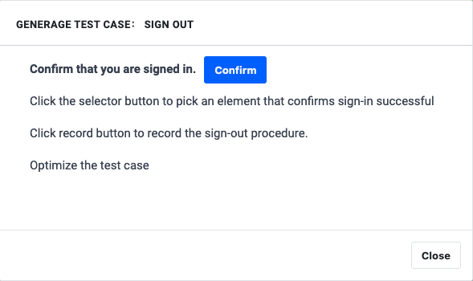

1. Confirm that the user is logged in. Click confirm.
2. Pick an element that will only show when logged in. Note: This should not be a user-specific element but should show for all users. 
3. Record the sign-out procedure.
4. Click "Optimize the test case"
5. The sign-out test case has now been generated.

**Check all accounts**


1. Click "Check all accounts"
2. A test case that runs sign-in for each user has now been generated in the authorization module. This is useful to see how you can call Sign-in and Sign-out respectively.

### Using authorization tests

**Set test pre-conditions**


One way of using the authorization tests is to set test-preconditions on tests. If checking a user as a pre-conditions this means as soon as this test is run, Boozang will check if that user is logged in using the unique identifier. If not, Boozang will automatically run the "sign-out" test case and run "sign-in" for the first user in the list. 

**Calling authorization tests manually**


You can also call the authorization tests manually. This can be done by simply calling the "sign-in" test case directly. 

`$parameter = unique key`

This will trigger a check on which user is logged in, and if it´s different than specified, it will automatically trigger a logout and logout with the specified user.

## Gherkin/Cucumber support

To support Business-driven development, we have built-in Gherkin support in Boozang. The idea is that a business analyst or product owner write the acceptance criteria for a feature using Gherkin syntax (Given, When, Then). For each feature, the might be several scenarios that describe the acceptance criteria of the scenario. For an exhaustive description of the Cucumber / Gherkin language see https://cucumber.io/

### A note on the data model

In Boozang, we separate the business domain and technical domain. In the technical domain, there are modules and tests, while in the business domain there are features and scenarios. That means that the Boozang data model works really well to handle this hierarchy. To tie the business domain to the technical domain, we use so-called Link tests, that maps the Gherkin syntax to a test and handles the parameter transfer.

### Example test

Throughout this example, we will use the following example test to illustrate the functionality.

`Feature: Google Searching`

As a web surfer, I want to search Google, so I can learn new things

Scenario: Simple Google searches

​    Given a web browser is on the Google page
​    When the search phrase "<phrase>" is entered
​    Then results for "<phrase>" are shown
​    And the related results include "<related>"    

    Examples: Animals
      | phrase   | related       |
      | panda    | Panda Express |
      | elephant | Elephant Man  | 
### Features


Just as modules act as containers for tests, features works as containers for scenarios. Features can either be created directly in Boozang, or imported from a feature file.

### Importing feature files

To import features simply click "Import Feature". Bozang supports two types of imports

- Import from test
- Import from file

**Import from text**


To import from text, simply paste the Gherkin feature text into the window. The feature will be automatically created in the features tab with the name specified in the `Feature:` section (in our case `Google Search`).

Boozang will now parse the Feature information and build all the scenarios inside the feature. In addition, any example data will be added to the scenarios as CSV data, and the parameter mapping will be generated automatically. 

**Import from file**

Simply click import from file, and browse to the `.feature`file you want to import. 

### Building your first scenarios

**Unmatched scenarios**

As soon as you have imported a feature, all feature scenarios will be generated automatically. As you can see from the example below, the `Given`, `When`and `Then`are generated as Groups in Boozang, with a number of `Plug test-case` conditions. As you can see, the unmatched conditions are marked red.   

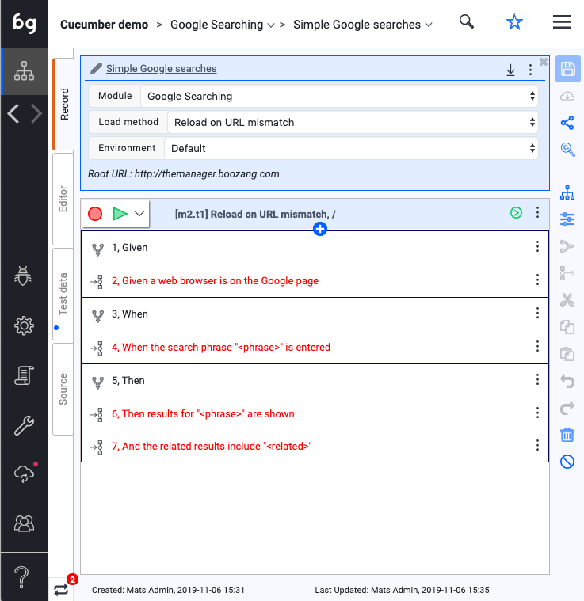

**Matching scenarios**

To match a scenario, simply click on "New Link-Test" in the Goto Test Case section. This will create a new link test that matches the text "When the search phrase ? is entered" and automatically populate the necessary data. 


This will automatically create a "Link Test" that translates the Gherkin syntax to executable code. 

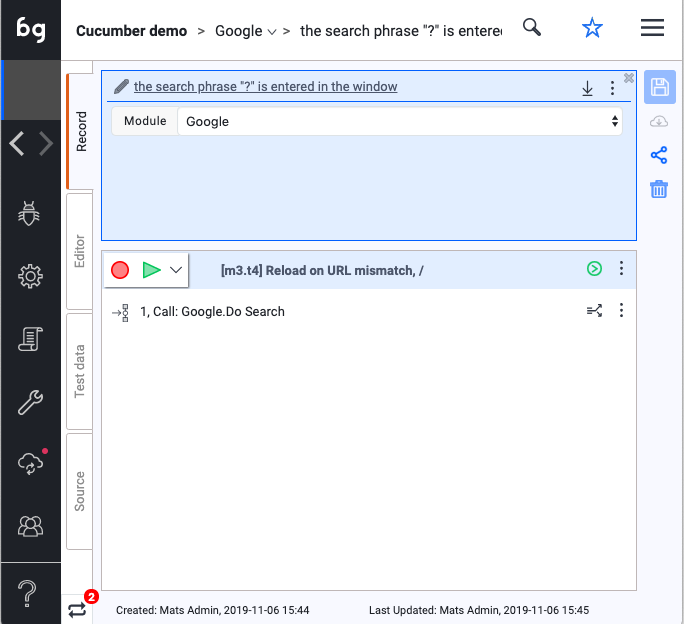

**Link tests and re-use**

One might wonder why to introduce link tests in the first place? Why not simply have a single mapping of Gherkin syntax that maps to a test. The answer is re-use. Imagine we have the following test: `LoginHandler` that takes `role` as a parameter. If in Gherkin's we have the following statements

`Given I am logged in as an Admin`

`Given I am logged in as a User`

we would typically have to have two different functional tests. This would create unnecessary code duplication and bloat. With the introduction of Link test, we can now map this case with two different link tests, without having to create two functional tests

`I am logged in as a ?` pointing to `LoginHandler`

`I am logged in as an ?` pointing to `LoginHandler`

As link tests support parameter data, we can also further create tests aliases using link-tests

`LogMeInAsAdmin`points to `LoginHandler`sending `Admin`as parameter. 

`LogMeInAsUser`points to `LoginHandler`sending `User`as parameter. 

It also has a second benefit. As the Gherkin syntax of features is`I am Logged in as a` to the more appropriate `I am logged in as`,  you simply have to update a single link test, and all scenarios using that phrasing will be updated automatically. 

**The magic wand**

As you keep adding features you will undoubtedly have created many Link-tests to tie the business domain (natural language with examples) to the technical domain (tests with data). In some cases, you might have completed the mapping for a single feature, but still have many features to complete. To not do the same work twice, you can apply existing mapping to a feature by hitting the "match icon" (the magic wand). This will automatically apply any existing mappings, greatly speeding up the mapping job. 


### Running tests

**Running a scenario**

To run a scenario, simply use the "Play" button in the scenario list or in the scenario detail view.

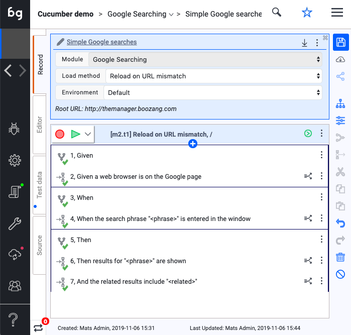   

A report will be generated from the scenario.

**Running an unfinished scenario**

In the case of running a scenario that has some "unlinked" test steps, the error message "Not Implemented" will be show in the report for these test steps. 

**Running all scenarios of a feature**

To run all the scenarios of a feature, simply run the test suite generated that has the Feature name. 

**A note on performance**

The feature test suite allows you to order what order scenarios should be run. This might seem unnecessary at first, as scenarios should be able to run independently of pre-conditions. Scenario run order might have a big impact on execution time. One good example is for scenarios that have pre-conditions that line up. For instance, imagine the following sequence of scenarios

Sequence 1:

1. Given I am logged in as Admin, When I do A, Then I should have B
2. Given I am logged in as User, When I do A, Then I should have B
3. Given I am logged in as Admin, When I do C, Then I should have D
4. Given I am logged in as User, When I do C, Then I should have D

Sequence 2:

1. Given I am logged in as Admin, When I do A, Then I should have B
2. Given I am logged in as Admin, When I do C, Then I should have D
3. Given I am logged in as User, When I do A, Then I should have B
4. Given I am logged in as User, When I do C, Then I should have D

If implemented correctly, both of these sequences should be able to execute successfully, as there should be no dependency on the initial state. On the other hand, Sequence 1 requires four (4) Login/Logout sequences while Sequence 2 only requires two (2). Taking into account the order the scenarios are run can greatly speed up testing, and also remove a lot of testing complexity and brittleness. Another telling example is scenarios `Add`, `Edit`, and `Delete`.

## Model-based testing

This section will focus on automated test creation driven from models. A model is simply a classification of different components and elements in your application, that allows the boozang engine to automatically generate function tests and simple workflows, that gives a great starting point for your application testing.

### Advantages of model-based testing

**Auto-generated re-usable test steps**

As the application model is created, the Boozang engine will create a series of auto-generated tests that can be used to build upstream tests. 

**Auto-generated workflows**

As the application model is created, the Boozang engine will create simple workflow tests for common test scenarios. These will act as a blueprint to create all higher order tests. 

**Test Stability**

Model-based testing is completely different from recording scenarios, as tests are automatically updated as the model changes. This means if an aspect of the application changes, only that part of the model needs to be updated, and all tests will automatically be updated. 

**Graphical overview**

By creating a model of your application, a full graphical representation of the application is created. This gives everyone in the application team a complete picture of all application logic, and ...

**Non-requirement driven tests**

By modeling the application, the boozang engine can auto-generate tests that do not originate from business requirements but are still important. This gives you a baseline of tests to work as a health-check for the application functionality. 

## Integrations and test scheduling


Note: This section will focus on running Boozang from the command line.  For readers not familiar with CLI and Docker this might be a little technical, even though most of the commands should be working doing a direct copy.

### Test URLs and authorization

Even though tests can easily be run using the web browser, there will be a need to trigger these tests without manual interaction. The most common scenario is to run a set of tests when code is pushed into GitHub or other versioning systems, normally through a Continous Integration (CI) server integration. There are also other applications: one might want to trigger tests via a server cronjob or trigger it directly via a build job or Ansible command. The basis of all this is to be able to trigger a test from the command line. 

**Test Stability**

All tests in Boozang are dependant on the web browser. As no special APIs such as Selenium Webdriver is being used, tests in Boozang operate the same way when playing in the web browser and when playing back from the command line. This means tests that are stable upon authoring, should run stable when running from CI server too.

**Test URLs**

The first thing to recognize when running from command-line (CLI) is that all tests in Boozang are unique URLs. This means they can be shared, linked and referenced freely from ticketing systems, reports and emails. 

**Authorization token**

When running a test from the command line it's important that the user running has the right access rights. This is done by specifying an access token. The access token logs in the user with limited access rights, so the user can read the test and execute it, but all write and admin permissions are revoked. This is for security purposes as the token is long-lived. 

**Getting the Access token**

An access token can be retrieved in the Boozang Management UI by clicking the Account -> Get Token and entering your password. Keep this token secret and safe. 

**Generating a tokenized test URL**


It can also be retrieved from the IDE interface when sharing a single test. The user will again be prompted for a password to get a tokenized test URL, which can be run from the command-line.  

**Running from command-line**

There are many ways to run Boozang tests from the command line but here are the recommended options: Installing the test runner using the **Docker Xvfb container** or **Boozang npm package**. 

### Docker Xvfb container 


The test runner is Open Source and the Docker container can be found here: https://hub.docker.com/r/styrman/boozang-runner/ and corresponding source code here: https://github.com/ljunggren/bz-docker-xvfb

**Installing Docker CE** 

Docker is widely supported but does require some amount of disk space. To find installation instructions for your operating system, follow the guide here: https://docs.docker.com/install/ (make sure to select your operating system in the left menu navigation).

Make sure docker is running by typing

`docker`

and make sure the following output is generated

`Usage:    docker [OPTIONS] COMMAND`

**Running a test**

To run a test, type

`docker run --rm -v "$(pwd):/var/boozang/" styrman/boozang-runner "[tokenized-test-url]"`

**Getting the latest image**

The boozang-runner image will be cached so to make sure you are running the latest Docker image, type

`docker pull styrman/boozang-runner:latest`

**Modifying the Boozang docker image**

To modify the Docker image, retrieve it using the following command

 `docker pull styrman/boozang-runner:latest`

As you will not be able to update the official Boozang Docker image, make sure to tag it with your user-name

`docker tag boozang-runner your-docker-user/boozang-runner`

do the modifications, build the container

`docker build -t your-docker-user/boozang-runner`

and when you are happy with it, finally push it to the Cloud

`docker push your-docker-user/boozang-runner:latest`

**Additional CLI options**

To find current supported command-line options, see Docker Github readme: https://github.com/ljunggren/bz-docker-xvfb and command-line runner README: https://github.com/ljunggren/bz-puppeteer.

### NPM Package


The NPM package is Open source and the source code can be found here: https://github.com/ljunggren/bz-puppeteer

**Installing NodeJS**

NodeJS is widely supported. We recommend that you run Node v8.9.0+ (we rely on async/await so NodeJS 6.x is not supported). To install NodeJS we recommend using a package manager (https://nodejs.org/en/download/package-manager/) but you can also install it from source (https://nodejs.org/en/download/). 

After installation, verify that node and npm versions the following way

`npm --version`

`5.5.1`

`node --version`

`v8.9.0`

**Installing the Boozang package**

To install the Boozang test runner, type

`npm install -g boozang`

The Boozang package will be installed alongside with a Chrome browser compatible with Puppeteer. Make sure the Boozang package has been installed by typing

`boozang`

`USAGE: boozang [--token] [--headfull] [--verbose] [--screenshot] [--file=report] [--device=default] [url]`

**Running a test**

To run a test, type

`boozang "[tokenized-test-url]"`

The test should start executing in headless or headful mode and return a report in the prompt. 

**Modifying the NPM package**

To modify the Boozang test runner and do custom development work, clone the code locally

`git clone https://github.com/ljunggren/bz-puppeteer`

To install any dependencies, run

`npm install`

This will automatically download and install a Chrome browser compatible with Puppeteer. 

To test run you package, run

`node index  "[tokenized-test-url]"`

Update the package by modifying `index.js`and commit your changes to your versioning system. 

When you want to publish the package to `npm`, update `package.json`to reflect your package name (don't use `"boozang"`) 

`"name": "your-npm-name",
  "version": "3.1.7",
  "description": "An Simple Driver for Chrome Headless basded on Puppeteer",
  "dependencies": {
    "node-options": "latest",
    "puppeteer": "latest"
  }`

and 

`"bin": {
    "your-npm-name": "index.js"
  }`

and publish it to npm using

`npm publish`

Your package should now be available for installation anywhere running

`npm install -g your-npm-name`

and you can test run it by typing

`your-npm-name`

anywhere. 

**Additional CLI options**

To find current supported command-line options, see Github readme: https://github.com/ljunggren/bz-puppeteer

### Parallel test execution

Installing the Docker container makes it dead simple to create your test execution scripts. Here are a few examples 

**Running from cronjob**

It's easy to set up a cronjob that runs a Boozang test at a scheduled time. Type

`crontab -e`

to edit crontab settings create a custom script that runs your test. See below example from Centos

`cd`

`mkdir scripts`

`vi scripts/run_boozang_tests`

and add the tests needed (either using npm package or Docker container).

**Running tests in parallel from scratch**

To run tests in parallel, we utilize `nohup` and the `&`operator.

`nohup docker run --rm -v "$(pwd):/var/boozang/" styrman/boozang-runner --file=test1 "[tokenized-test-url-1]"> test1.log &`

`nohup docker run --rm -v "$(pwd):/var/boozang/" styrman/boozang-runner --file=test2 "[tokenized-test-url-2]"> test2.log &`

In this example, you can follow the progress of the tests in `test1.log` and `test2.log` respectively, and the report will be found in HTML format in `test1.html` and `test2.html`, and in JSON format in `test1.json` and `test2.json`.

**Running tests in parallel using GNU parallel**

You can also create an automated test runners that uses a given number of worker processes to run tests. In this example we use the great GNU parallel (https://www.gnu.org/software/parallel/). This allows us to simply dispatch tests to a number of worker processes.

- Install GNU parallel. CentOS instructions can be found here: https://medium.com/@gchandra/simple-tutorial-to-install-use-gnu-parallel-79251120d618
- Download file `parallel_runs.sh`from `https://github.com/boozang/bz-utils/scripts`  
- Add test URLs (tokenized) to a file `testlist.txt`
-  Modify `parallel_runs.sh` to set the appropriate workers
- Set the script to executable `chmod +x paralell_runs.sh`
- Run the script `./paralell_runs.sh`
- This will spawn off a Docker container for each worker specified

**Building your own test dispatcher**

We encourage you to build your own test dispatcher. Take a look at `./parallel_runs.sh`to get inspiration. It's only one line of code!

` parallel -a testlist.txt -j5 'nohup sudo docker run --rm -v "$(pwd):/var/boozang/" styrman/boozang-runner --file={#} {} > /home/centos/scripts/docker/test/w{%}_t{#}.log'`

In this example, tests written in `testlist.txt`are processed by `parallel`by 5 workers (specifed by the `-j`flag). The test logs are available in the `wX_tY.log`files, where `X`is the worker index, and `Y`is the test index. Result logs will be available in the file named as the test index `Y`.      

**More examples**

You can find these examples and more at  https://github.com/ljunggren/bz-utils

### Test Scheduling

You can also use Boozang's built-in scheduler. It works very much like a `cronjob`, except that the timing parameters are added to the URL after the "/run" part of the URL, like

`nohup docker run --rm -v "$(pwd):/var/boozang/" styrman/boozang-runner --file=test1 "[tokenized-test-url-1]/run?every=10"> test1.log &`

This command will keep the test running in the browser inside the Docker container, and run the test every 10 minutes.

Boozang offers a flexible way to schedule tasks:

**In=** *[min]*

Such as: ... / run? in = 10
This means that the test is executed immediately, and tested again 10 minutes after completion

**Every=** *[min]*

Such as: .. / run? every = 10
This means that the test is executed immediately, and the execution is executed 10 minutes after the first test starts.

**At=** *[min]*

Such as: ... / run? at = 15, 45
This means that the test is not executed immediately, and the test task is executed at a specified time (15, 45). According to this example, if the current time is 15:52, the first execution time is 16:15, and the next time is: 16:45

**At=** *[time]*

Such as: .../run?at=13:30, 20:00
This means that the test is not executed immediately, and it is executed at a specified time. According to this example, if the current time is 15:52, the first execution is performed. The time is 20:30. Then the second execution time is 13:30 tomorrow.

**On=** *[day]* **&at=** *[min/time]*

Such as: .. / run? on = mon & at = 13: 30
This means that the test is not executed immediately, according to the specified date and time. According to this example, the test time is 13:30 next Monday. Note: "on" must be used together with "at". For "on" you can use the following values:
Monday or mon or 0 (for Monday)
Tuesday or tue or 1 (for Tuesday)
Wednesday or wed or 2 (for Wednesday)
Thursday or thu or 3 (for Thursday)
Friday or fri or 4 (for Friday)
Saturday or sat or 5 (for Saturday)
Sunday or sun or 6 (for Sunday)
workday (for Monday to Friday)
also supports multiple, such as on=wed, fri, or on=workday, Sat

"now": Refers to the test immediately. For example, the user needs to use on but wants to perform the test task immediately, such as.../run?at=13:50&on=work&now

### A note on Open Source

To build a strong ecosystem around Boozang we have decided to keep all client-side code Open Source and allow our customers to customize it as they wish. The reason for this is two-fold: 

1. All customer systems are slightly different, and even if we can cover most scenarios we cannot cover all. 
2. As our customer base grows, custom code made by one customer can directly be re-used by another customer, creating a benefit that scale with our customer base. 

We, therefore, encourage our users to keep their custom code open source and share it openly. We also encourage you to let us know at *opensource@boozang.com* so we can link to it. 

## Security


**Fragment security**

When installing the bz-fragment we get the security of the web browser without the limitation of being bound to Chrome extension policy. This limits cross-browser execution but allows running Boozang without the need of any Extension. 

Note: This requires access to the application directory to install an HTML fragment. 

**GDPR**

As we are running locally in your web browser it´s been easier to be GDPR compliant than for regular Cloud-testing services. We recommend that you'll host sensitive test data in CSV files hosted on your servers. That way, the data will never be loaded into our Cloud, and be present in the browser local storage on the test computers.

**Hosting**

In our Cloud, we host the data you enter into our system and the tests, including our proprietary element selectors. To get an understanding of the kind of data we store, you can look at the Source tab on any test. Our servers are located in Canada. 

## Trade-offs


There are several limitations to the Boozang technology, some that are a limiting factor of the technology and security of the browser context, and others that are conscious product decisions. Here is an attempt to address some of them head-on.

**Only web**

Boozang support only testing web and hybrid applications. There are plenty of good tools to test native and desktop applications in the market, and we will be happy to recommend some. When doing testing across web and native/desktop, we recommend driving the tests on the web over Boozang, while driving the other tests over another tool. Boozang has excellent support to read data from external sources and is designed to be able to have a source of truth outside the tool. 

**No tests are driven from the Cloud**

Boozang doesn´t currently drive your tests from the Cloud. The Boozang technology allows us to host your tests and allow you to drive them locally from your browser. This has the benefits that we can operate behind your company firewall without any problem. It also means that you can host the test data locally, and serve it up to your local web browser. 

As our test runner is open source and can be used and modified freely, we welcome companies and Cloud testing providers to do so, and we welcome serious partnership proposals. 

**Limited BI** 

Long-term we will expand our reporting capability and business intelligence functions. As we expose our reports in both JSON and HTML, and fully support integration over REST or via our test-runner (DIY), we are welcoming you to integrate into your Business Intelligence system of choice, and for you to see Boozang as one source of insights among many.

**Frequent Maintenance Releases**

We do nightly maintenance releases frequently, sometimes as often as once per week. All paying subscribers will be notified when this release takes place, but often they are done 10 pm - 1 am EST during Sundays (this time-slot works for both European and American customers, and amounts to a maximum of 30 seconds of service down-time). This means that we generally can provide less than a one-week turnaround on bugs reported by our customers.

Copyright (c) 2019 Boozang Technologies Inc.

